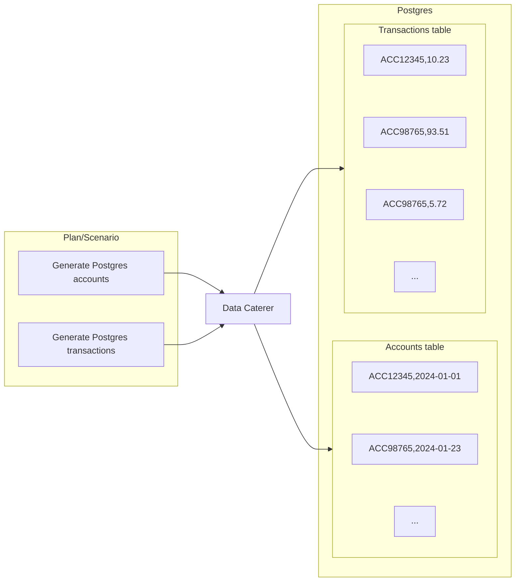
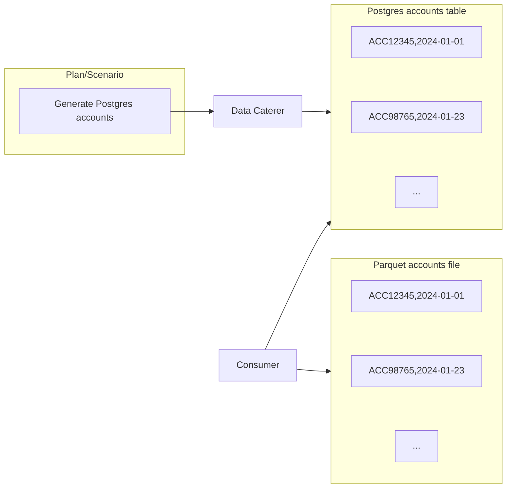
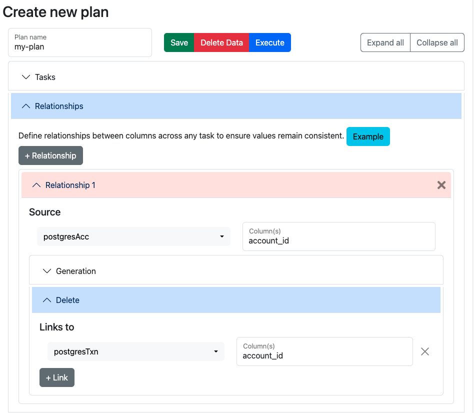

# Delete Generated Data

Data Caterer tracks generated records and can delete them on demand, including downstream data consumed by services/jobs. This helps you:

1. Keep test environments clean
2. Prevent test data pollution
3. Enable reliable test workflows
4. Clean up data across multiple related systems

## How It Works

1. **Record Tracking**: During generation, Data Caterer tracks all generated records in a specified folder
2. **Deletion**: Uses tracked records to delete only generated data (preserves manually added data)
3. **Foreign Keys**: Respects relationships and deletes in reverse insertion order
4. **Downstream Data**: Can delete data in systems that consumed generated records

## Supported Data Sources

- **JDBC Databases**: Postgres, MySQL, Oracle, SQL Server, etc.
- **Cassandra**: NoSQL database
- **Files**: CSV, JSON, Parquet, ORC, Delta Lake

## Foreign Keys/Relationships

You can either define a foreign key for data generation (i.e. create same account numbers across accounts and
transactions table)
or for data deletion (i.e. account numbers generated in Postgres are consumed by a job and pushed into a Parquet file,
you
can delete the Postgres and Parquet data via the account numbers generated).

### Generate

In scenarios where you have defined foreign keys for multiple data sources, when data is generated, Data Caterer will
ensure that the values generated in one data source, will be the same in the other. When you want to delete the data,
data will be deleted in reverse order of how the data was inserted. This ensures that for data sources, such as
Postgres, no errors will occur whilst deleting data.



#### Configuration

To define the generated data that should be deleted, follow the below configurations:

=== "Java"

    ```java
    var postgresAcc = postgres("my_postgres", "jdbc:...")
      .table("public.accounts")
      .fields(
        field().name("account_id"),
        field().name("name"),
        ...
      );
    var postgresTxn = postgres(postgresAcc)
      .table("public.transactions")
      .fields(
        field().name("account_id"),
        field().name("full_name"),
        ...
      );

    var deletePlan = plan().addForeignKeyRelationship(
      postgresAcc, "account_id",
      List.of(Map.entry(postgresTxn, "account_id"))
    );

    var deleteConfig = configuration()
      .enableRecordTracking(true)
      .enableDeleteGeneratedRecords(true)
      .enableGenerateData(false);

    execute(deletePlan, deleteConfig, postgresAcc, postgresTxn);
    ```

=== "Scala"

    ```scala
    val postgresAcc = postgres("my_postgres", "jdbc:...")
      .table("public.accounts")
      .fields(
        field.name("account_id"),
        field.name("name"),
        ...
      )
    val postgresTxn = postgres(postgresAcc)
      .table("public.transactions")
      .fields(
        field.name("account_id"),
        field.name("full_name"),
        ...
      )

    val deletePlan = plan.addForeignKeyRelationship(
      postgresAcc, "account_id",
      List(postgresTxn -> "account_id")
    )

    val deleteConfig = configuration
      .enableRecordTracking(true)
      .enableDeleteGeneratedRecords(true)
      .enableGenerateData(false)

    execute(deletePlan, deleteConfig, postgresAcc, postgresTxn)
    ```

=== "YAML"

    ```yaml
    ---
    name: "postgres_data"
    steps:
      - name: "accounts"
        type: "postgres"
        options:
          dbtable: "account.accounts"
        fields:
          - name: "account_id"
          - name: "name"
      - name: "transactions"
        type: "postgres"
        options:
          dbtable: "account.transactions"
        fields:
          - name: "account_id"
          - name: "full_name"
    ---
    name: "customer_create_plan"
    description: "Create customers in JDBC"
    tasks:
      - name: "postgres_data"
        dataSourceName: "my_postgres"

    sinkOptions:
      foreignKeys:
        - source:
            dataSource: "postgres"
            step: "accounts"
            fields: ["account_id"]
          generate:
            - dataSource: "postgres"
              step: "transactions"
              fields: ["account_id"]
    ```

=== "UI"

    

### Delete

Once you have generated data, you may consume it via a job or service and push that data down into other data sources.
You can choose to also delete the data that is pushed down into the other data sources by defining a delete relationship.



#### Configuration

We will use the scenario that we generate data for `accounts` table in Postgres and a job will insert a record into the
`balances` table for each record generated. To define the consumed data that should also be deleted,
follow the below example:

=== "Java"

    ```java
    var postgresAcc = postgres("my_postgres", "jdbc:...")
      .table("public.accounts")
      .fields(
        field().name("account_id"),
        field().name("name"),
        ...
      );
    var postgresBal = postgres(postgresAcc)
      .table("public.balances");

    var deletePlan = plan().addForeignKeyRelationship(
      postgresAcc, "account_id",
      List.of(),
      List.of(Map.entry(postgresBal, "account_id"))
    );

    var deleteConfig = configuration()
      .enableRecordTracking(true)
      .enableDeleteGeneratedRecords(true)
      .enableGenerateData(false);

    execute(deletePlan, deleteConfig, postgresAcc);
    ```

=== "Scala"

    ```scala
    val postgresAcc = postgres("my_postgres", "jdbc:...")
      .table("public.accounts")
      .fields(
        field.name("account_id"),
        field.name("name"),
        ...
      )
    val postgresBal = postgres(postgresAcc)
      .table("public.balances")

    val deletePlan = plan.addForeignKeyRelationship(
      postgresAcc, "account_id",
      List(),
      List(postgresBal -> "account_id")
    )

    val deleteConfig = configuration
      .enableRecordTracking(true)
      .enableDeleteGeneratedRecords(true)
      .enableGenerateData(false)

    execute(deletePlan, deleteConfig, postgresAcc)
    ```

=== "YAML"

    ```yaml
    ---
    name: "postgres_data"
    steps:
      - name: "accounts"
        type: "postgres"
        options:
          dbtable: "account.accounts"
        fields:
          - name: "account_id"
          - name: "name"
      - name: "balances"
        type: "postgres"
        options:
          dbtable: "account.balances"
    ---
    name: "customer_create_plan"
    description: "Create customers in JDBC"
    tasks:
      - name: "postgres_data"
        dataSourceName: "my_postgres"

    sinkOptions:
      foreignKeys:
        - source:
            dataSource: "postgres"
            step: "accounts"
            fields: ["account_id"]
          delete:
            - dataSource: "postgres"
              step: "balances"
              fields: ["account_id"]
    ```

=== "UI"

    

## Quick Reference

### Configuration Flags

| Flag                           | Purpose                      | Generation Phase | Deletion Phase |
| ------------------------------ | ---------------------------- | ---------------- | -------------- |
| `enableRecordTracking`         | Track generated records      | `true`           | `true`         |
| `enableGenerateData`           | Generate new data            | `true`           | `false`        |
| `enableDeleteGeneratedRecords` | Delete tracked data          | `false`          | `true`         |
| `recordTrackingFolderPath`     | Where to store tracking data | Set path         | Same path      |

### Deletion Behavior

- **Only Tracked Records**: Only deletes records that were generated and tracked
- **Preserves Manual Data**: Manually inserted records are not affected
- **Reverse Order**: Deletes related records in reverse insertion order (respects foreign keys)
- **Downstream Support**: Can delete data consumed by services/jobs using `delete` relationships
- **Same Configuration**: Must use same connection names and tracking folder path

### Common Patterns

**Pattern 1: Generate then Delete (same class)**

```scala
// First run: Generate with tracking
val config = configuration
  .enableRecordTracking(true)
  .enableGenerateData(true)

// Second run: Delete by changing flags
val deleteConfig = configuration
  .enableRecordTracking(true)
  .enableDeleteGeneratedRecords(true)
  .enableGenerateData(false)
```

**Pattern 2: Separate Classes**

```scala
// GeneratePlan.scala
class GeneratePlan extends PlanRun {
  val config = configuration
    .postgres("my_db", "jdbc:...")
    .enableRecordTracking(true)
    .recordTrackingFolderPath("/shared/tracking")
}

// DeletePlan.scala
class DeletePlan extends PlanRun {
  val config = configuration
    .postgres("my_db", "jdbc:...")  // Same connection name!
    .enableRecordTracking(true)
    .enableDeleteGeneratedRecords(true)
    .enableGenerateData(false)
    .recordTrackingFolderPath("/shared/tracking")  // Same path!
}
```

**Pattern 3: Downstream Data Cleanup**

```scala
// Define what was generated vs what was consumed downstream
val deletePlan = plan.addForeignKeyRelationship(
  sourceTask, "key_field",
  List(),  // No generation relationships
  List(downstreamTask -> "key_field")  // Delete relationships
)
```

### Troubleshooting

| Issue                              | Cause                                | Solution                                                                 |
| ---------------------------------- | ------------------------------------ | ------------------------------------------------------------------------ |
| "Failed to get tracked records"    | Tracking folder not found            | Ensure `recordTrackingFolderPath` is same for generation and deletion    |
| "Format not defined"               | Data source missing format           | Check step configuration has valid format                                |
| No records deleted                 | Connection name mismatch             | Use identical connection names in both phases                            |
| Manual data deleted                | Record tracking captured manual data | Don't enable tracking when manual data exists, or regenerate environment |
| Foreign key errors during deletion | Wrong deletion order                 | Data Caterer automatically handles this - check logs for errors          |

### Example Workflow

```bash
# 1. Generate data with tracking
./run.sh GeneratePlan

# 2. Run your tests/validations
./run_tests.sh

# 3. Delete generated data
./run.sh DeletePlan

# 4. Verify cleanup
# Only manually inserted data remains
```

See the [Delete Generated Data Guide](guide/scenario/delete-generated-data.md) for a complete walkthrough.
