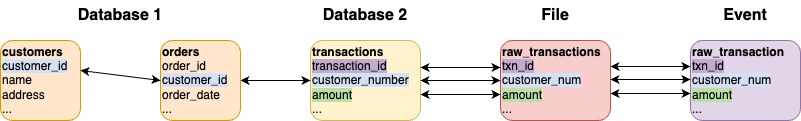

# Relationships/Foreign Keys



Foreign keys can be defined to represent the relationships between datasets where values are required to match for
particular fields.

## Single field

Define a field in one data source to match against another field.
Below example shows a `postgres` data source with two tables, `accounts` and `transactions` that have a foreign key
for `account_id`.

=== "Java"

    ```java
    var postgresAcc = postgres("my_postgres", "jdbc:...")
      .table("public.accounts")
      .fields(
        field().name("account_id"),
        field().name("name"),
        ...
      );
    var postgresTxn = postgres(postgresAcc)
      .table("public.transactions")
      .fields(
        field().name("account_id"),
        field().name("full_name"),
        ...
      );

    plan().addForeignKeyRelationship(
      postgresAcc, "account_id",
      List.of(Map.entry(postgresTxn, "account_id"))
    );
    ```

=== "Scala"

    ```scala
    val postgresAcc = postgres("my_postgres", "jdbc:...")
      .table("public.accounts")
      .fields(
        field.name("account_id"),
        field.name("name"),
        ...
      )
    val postgresTxn = postgres(postgresAcc)
      .table("public.transactions")
      .fields(
        field.name("account_id"),
        field.name("full_name"),
        ...
      )

    plan.addForeignKeyRelationship(
      postgresAcc, "account_id",
      List(postgresTxn -> "account_id")
    )
    ```

=== "YAML"

    In a unified YAML file:
    ```yaml
    name: "customer_create_plan"
    description: "Create customers in JDBC"

    dataSources:
      - name: "my_postgres"
        connection:
          type: "postgres"
          options:
            url: "jdbc:postgresql://localhost:5432/customer"
            user: "postgres"
            password: "postgres"
        steps:
          - name: "accounts"
            options:
              dbtable: "account.accounts"
            fields:
              - name: "account_id"
              - name: "name"
          - name: "transactions"
            options:
              dbtable: "account.transactions"
            fields:
              - name: "account_id"
              - name: "full_name"

    foreignKeys:
      - source:
          dataSource: "my_postgres"
          step: "accounts"
          fields:
            - "account_id"
        generate:
          - dataSource: "my_postgres"
            step: "transactions"
            fields:
              - "account_id"
    ```

## Multiple fields

You may have a scenario where multiple fields need to be aligned. From the same example, we want `account_id`
and `name` from `accounts` to match with `account_id` and `full_name` to match in `transactions` respectively.

=== "Java"

    ```java
    var postgresAcc = postgres("my_postgres", "jdbc:...")
      .table("public.accounts")
      .fields(
        field().name("account_id"),
        field().name("name"),
        ...
      );
    var postgresTxn = postgres(postgresAcc)
      .table("public.transactions")
      .fields(
        field().name("account_id"),
        field().name("full_name"),
        ...
      );

    plan().addForeignKeyRelationship(
      postgresAcc, List.of("account_id", "name"),
      List.of(Map.entry(postgresTxn, List.of("account_id", "full_name")))
    );
    ```

=== "Scala"

    ```scala
    val postgresAcc = postgres("my_postgres", "jdbc:...")
      .table("public.accounts")
      .fields(
        field.name("account_id"),
        field.name("name"),
        ...
      )
    val postgresTxn = postgres(postgresAcc)
      .table("public.transactions")
      .fields(
        field.name("account_id"),
        field.name("full_name"),
        ...
      )

    plan.addForeignKeyRelationship(
      postgresAcc, List("account_id", "name"),
      List(postgresTxn -> List("account_id", "full_name"))
    )
    ```

=== "YAML"

    In a unified YAML file:
    ```yaml
    name: "customer_create_plan"
    description: "Create customers in JDBC"

    dataSources:
      - name: "my_postgres"
        connection:
          type: "postgres"
          options:
            url: "jdbc:postgresql://localhost:5432/customer"
            user: "postgres"
            password: "postgres"
        steps:
          - name: "accounts"
            options:
              dbtable: "account.accounts"
            fields:
              - name: "account_id"
              - name: "name"
          - name: "transactions"
            options:
              dbtable: "account.transactions"
            fields:
              - name: "account_id"
              - name: "full_name"

    foreignKeys:
      - source:
          dataSource: "my_postgres"
          step: "accounts"
          fields:
            - "account_id"
            - "name"
        generate:
          - dataSource: "my_postgres"
            step: "transactions"
            fields:
              - "account_id"
              - "full_name"
    ```

## Transformed field

Scenarios exist where there are relationships defined by certain transformations being applied to the source data.

For example, there may be accounts created with a field `account_number` that contains records like `123456`. Then another
data source contains `account_id` which is a concatenation of `ACC` with `account_number` to have values like `ACC123456`.

=== "Java"

    ```java
    var postgresAcc = postgres("my_postgres", "jdbc:...")
      .table("public.accounts")
      .fields(
        field().name("account_number"),
        field().name("name"),
        ...
      );
    var jsonTask = json("my_json", "/tmp/json")
      .fields(
        field().name("account_id").sql("CONCAT('ACC', account_number)"),
        field().name("account_number").omit(true)  //using this field for intermediate calculation, not included in final result with omit=true
        ...
      );

    plan().addForeignKeyRelationship(
      postgresAcc, List.of("account_number"),
      List.of(Map.entry(jsonTask, List.of("account_number")))
    );
    ```

=== "Scala"

    ```scala
    val postgresAcc = postgres("my_postgres", "jdbc:...")
      .table("public.accounts")
      .fields(
        field.name("account_number"),
        field.name("name"),
        ...
      )
    var jsonTask = json("my_json", "/tmp/json")
      .fields(
        field.name("account_id").sql("CONCAT('ACC', account_number)"),
        field.name("account_number").omit(true)  //using this field for intermediate calculation, not included in final result with omit=true
        ...
      )

    plan.addForeignKeyRelationship(
      postgresAcc, List("account_number"),
      List(jsonTask -> List("account_number"))
    )
    ```

=== "YAML"

    In a unified YAML file:
    ```yaml
    name: "customer_create_plan"
    description: "Create customers with transformed foreign key"

    dataSources:
      - name: "my_postgres"
        connection:
          type: "postgres"
          options:
            url: "jdbc:postgresql://localhost:5432/customer"
            user: "postgres"
            password: "postgres"
        steps:
          - name: "accounts"
            options:
              dbtable: "account.accounts"
            fields:
              - name: "account_number"
              - name: "name"

      - name: "my_json"
        connection:
          type: "json"
          options:
            path: "/tmp/json"
        steps:
          - name: "transactions"
            fields:
              - name: "account_id"
                options:
                  sql: "CONCAT('ACC', account_number)"
              - name: "account_number"
                options:
                  omit: true

    foreignKeys:
      - source:
          dataSource: "my_postgres"
          step: "accounts"
          fields:
            - "account_number"
        generate:
          - dataSource: "my_json"
            step: "transactions"
            fields:
              - "account_number"
    ```

## Nested field

Your schema structure can have nested fields which can also be referenced as foreign keys. But to do so, you need to
create a proxy field that gets omitted from the final saved data.

In the example below, the nested `customer_details.name` field inside the `json` task needs to match with `name`
from `postgres`. A new field in the `json` called `_txn_name` is used as a temporary field to facilitate the foreign
key definition.

=== "Java"

    ```java
    var postgresAcc = postgres("my_postgres", "jdbc:...")
      .table("public.accounts")
      .fields(
        field().name("account_id"),
        field().name("name"),
        ...
      );
    var jsonTask = json("my_json", "/tmp/json")
      .fields(
        field().name("account_id"),
        field().name("customer_details")
          .fields(
            field().name("name").sql("_txn_name") //nested field will get value from '_txn_name'
            ...
          ),
        field().name("_txn_name").omit(true)       //value will not be included in output
      );

    plan().addForeignKeyRelationship(
      postgresAcc, List.of("account_id", "name"),
      List.of(Map.entry(jsonTask, List.of("account_id", "_txn_name")))
    );
    ```

=== "Scala"

    ```scala
    val postgresAcc = postgres("my_postgres", "jdbc:...")
      .table("public.accounts")
      .fields(
        field.name("account_id"),
        field.name("name"),
        ...
      )
    var jsonTask = json("my_json", "/tmp/json")
      .fields(
        field.name("account_id"),
        field.name("customer_details")
          .fields(
            field.name("name").sql("_txn_name") //nested field will get value from '_txn_name'
            ...
          ),
        field.name("_txn_name").omit(true)       //value will not be included in output
      )

    plan.addForeignKeyRelationship(
      postgresAcc, List("account_id", "name"),
      List(jsonTask -> List("account_id", "_txn_name"))
    )
    ```

=== "YAML"

    In a unified YAML file:
    ```yaml
    name: "customer_create_plan"
    description: "Create customers with nested foreign key"

    dataSources:
      - name: "my_postgres"
        connection:
          type: "postgres"
          options:
            url: "jdbc:postgresql://localhost:5432/customer"
            user: "postgres"
            password: "postgres"
        steps:
          - name: "accounts"
            options:
              dbtable: "account.accounts"
            fields:
              - name: "account_id"
              - name: "name"

      - name: "my_json"
        connection:
          type: "json"
          options:
            path: "/tmp/json"
        steps:
          - name: "transactions"
            fields:
              - name: "account_id"
              - name: "_txn_name"
                options:
                  omit: true
              - name: "customer_details"
                type: "struct"
                fields:
                  - name: "name"
                    options:
                      sql: "_txn_name"

    foreignKeys:
      - source:
          dataSource: "my_postgres"
          step: "accounts"
          fields:
            - "account_id"
            - "name"
        generate:
          - dataSource: "my_json"
            step: "transactions"
            fields:
              - "account_id"
              - "_txn_name"
    ```

## Cardinality (one-to-many)

By default, when a foreign key is defined without cardinality configuration, Data Caterer applies a **1:1 mapping**
where the child record count is adjusted to match the parent record count. To generate multiple child records per
parent (e.g. 5 orders per customer), you must configure cardinality on the target relation.

### Default behavior (1:1)

Without cardinality, the child count is adjusted to equal the parent count, regardless of the `records` value
you set on the child step.

```
customers (3 records)          orders (3 records, adjusted from requested 20)
+-------------+----------+    +----------+-------------+--------+
| customer_id | name     |    | order_id | customer_id | amount |
+-------------+----------+    +----------+-------------+--------+
| CUST001     | Alice    |    | ORD001   | CUST001     | 150.00 |
| CUST002     | Bob      |    | ORD002   | CUST002     | 200.00 |
| CUST003     | Carol    |    | ORD003   | CUST003     | 75.00  |
+-------------+----------+    +----------+-------------+--------+
```

### Fixed ratio

Use `ratio` to specify an exact number of child records per parent. For example, `ratio: 5.0` generates
exactly 5 orders per customer.

```
customers (3 records)          orders (15 records = 3 x 5)
+-------------+----------+    +----------+-------------+--------+
| customer_id | name     |    | order_id | customer_id | amount |
+-------------+----------+    +----------+-------------+--------+
| CUST001     | Alice    |    | ORD001   | CUST001     | 150.00 |
| CUST002     | Bob      |    | ORD002   | CUST001     | 200.00 |
| CUST003     | Carol    |    | ORD003   | CUST001     | 75.00  |
+-------------+----------+    | ORD004   | CUST001     | 300.00 |
                              | ORD005   | CUST001     | 50.00  |
                              | ORD006   | CUST002     | 120.00 |
                              | ORD007   | CUST002     | 80.00  |
                              | ORD008   | CUST002     | 210.00 |
                              | ORD009   | CUST002     | 95.00  |
                              | ORD010   | CUST002     | 175.00 |
                              | ORD011   | CUST003     | 60.00  |
                              | ORD012   | CUST003     | 340.00 |
                              | ORD013   | CUST003     | 110.00 |
                              | ORD014   | CUST003     | 225.00 |
                              | ORD015   | CUST003     | 190.00 |
                              +----------+-------------+--------+
```

=== "Java"

    ```java
    plan().addForeignKeyRelationship(
      postgresCustomers, "customer_id",
      List.of(Map.entry(postgresOrders, "customer_id")),
      new CardinalityConfig().ratio(5.0)
    );
    ```

=== "Scala"

    ```scala
    plan.addForeignKeyRelationship(
      postgresCustomers, "customer_id",
      List(postgresOrders -> "customer_id"),
      CardinalityConfig(ratio = Some(5.0))
    )
    ```

=== "YAML"

    ```yaml
    foreignKeys:
      - source:
          dataSource: "my_postgres"
          step: "customers"
          fields: ["customer_id"]
        generate:
          - dataSource: "my_postgres"
            step: "orders"
            fields: ["customer_id"]
            cardinality:
              ratio: 5.0
    ```

### Bounded range (min/max)

Use `min` and `max` to generate a variable number of child records per parent. Each parent will get between
`min` and `max` children.

```
customers (3 records)          orders (variable, 2-4 per customer)
+-------------+----------+    +----------+-------------+--------+
| customer_id | name     |    | order_id | customer_id | amount |
+-------------+----------+    +----------+-------------+--------+
| CUST001     | Alice    |    | ORD001   | CUST001     | 150.00 |
| CUST002     | Bob      |    | ORD002   | CUST001     | 200.00 |
| CUST003     | Carol    |    | ORD003   | CUST001     | 75.00  |
+-------------+----------+    | ORD004   | CUST002     | 300.00 |
                              | ORD005   | CUST002     | 50.00  |
                              | ORD006   | CUST003     | 120.00 |
                              | ORD007   | CUST003     | 80.00  |
                              | ORD008   | CUST003     | 210.00 |
                              | ORD009   | CUST003     | 95.00  |
                              +----------+-------------+--------+
```


=== "Java"

    ```java
    plan().addForeignKeyRelationship(
      postgresCustomers, "customer_id",
      List.of(Map.entry(postgresOrders, "customer_id")),
      new CardinalityConfig().min(2).max(4)
    );
    ```

=== "Scala"

    ```scala
    plan.addForeignKeyRelationship(
      postgresCustomers, "customer_id",
      List(postgresOrders -> "customer_id"),
      CardinalityConfig(min = Some(2), max = Some(4))
    )
    ```

=== "YAML"

    ```yaml
    foreignKeys:
      - source:
          dataSource: "my_postgres"
          step: "customers"
          fields: ["customer_id"]
        generate:
          - dataSource: "my_postgres"
            step: "orders"
            fields: ["customer_id"]
            cardinality:
              min: 2
              max: 4
    ```

!!! note "How record counts are calculated"
    When cardinality is configured, the child step's `records` count is automatically adjusted:

    - **Fixed ratio**: `child records = parent records x ratio`
    - **Bounded range**: `child records = parent records x max` (maximum possible)

    The original `records` value on the child step is overridden. The system sets up a `perField` count
    internally to group child records by the FK field.

!!! warning "Do not mix ratio and min/max"
    You cannot specify both `ratio` and `min`/`max` in the same cardinality configuration.
    Use one approach or the other.

## Generation modes

Generation modes control how foreign key values are assigned, specifically whether all records should have
valid FK references or if some should be intentionally invalid. This is configured via the `generationMode`
property on the target relation.

### all-exist (default)

Every child record gets a valid FK value referencing an existing parent. This is the default behavior and
produces data with full referential integrity.

```
customers                      orders (all-exist)
+-------------+----------+    +----------+-------------+
| customer_id | name     |    | order_id | customer_id |
+-------------+----------+    +----------+-------------+
| CUST001     | Alice    |    | ORD001   | CUST001     |  <-- valid
| CUST002     | Bob      |    | ORD002   | CUST003     |  <-- valid
| CUST003     | Carol    |    | ORD003   | CUST002     |  <-- valid
+-------------+----------+    | ORD004   | CUST001     |  <-- valid
                              | ORD005   | CUST003     |  <-- valid
                              +----------+-------------+
```

=== "YAML"

    ```yaml
    foreignKeys:
      - source:
          dataSource: "my_postgres"
          step: "customers"
          fields: ["customer_id"]
        generate:
          - dataSource: "my_postgres"
            step: "orders"
            fields: ["customer_id"]
            generationMode: "all-exist"     # default, can be omitted
    ```

### partial

A mix of valid and null FK values. This mode requires both a `nullability` configuration and a `cardinality`
configuration. The cardinality determines how many child records per parent, while the nullability specifies
what percentage of records should have null FKs. Useful for simulating data quality issues or testing how
your application handles missing references.

!!! warning "Partial mode requires cardinality"
    The `partial` generation mode only applies null FK values when combined with a `cardinality` configuration.
    Without cardinality, `partial` mode behaves identically to `all-exist` (all FKs are valid).

```
customers                      orders (partial with cardinality, 30% null)
+-------------+----------+    +----------+-------------+
| customer_id | name     |    | order_id | customer_id |
+-------------+----------+    +----------+-------------+
| CUST001     | Alice    |    | ORD001   | CUST002     |  <-- valid
| CUST002     | Bob      |    | ORD002   | NULL        |  <-- null
| CUST003     | Carol    |    | ORD003   | CUST001     |  <-- valid
+-------------+----------+    | ORD004   | CUST003     |  <-- valid
                              | ORD005   | NULL        |  <-- null
                              +----------+-------------+
```

=== "YAML"

    ```yaml
    foreignKeys:
      - source:
          dataSource: "my_postgres"
          step: "customers"
          fields: ["customer_id"]
        generate:
          - dataSource: "my_postgres"
            step: "orders"
            fields: ["customer_id"]
            generationMode: "partial"
            cardinality:
              ratio: 3.0                   # required for partial mode to apply nulls
            nullability:
              nullPercentage: 0.3          # 30% of records will have null FKs
              strategy: "random"
    ```

### all-combinations

Generates all possible valid/invalid combinations across FK fields. With `n` FK fields, this produces `2^n`
patterns. Useful for exhaustive testing of how your application handles every possible combination of
valid and invalid references.

For a single FK field, this produces 2 patterns: valid and invalid.
For two FK fields, this produces 4 patterns:

Invalid values are generated as `INVALID_` prefixed strings (for string fields) or random numbers (for
numeric fields), not null values. This ensures that invalid references are distinguishable from missing data.

```
locations                                stores (all-combinations with 2 FK fields)
+---------+-------+                      +----------+------------+------------+
| country | state |                      | store_id | country    | state      |
+---------+-------+                      +----------+------------+------------+
| USA     | NY    |                      | S001     | USA        | NY         |  <-- both valid
| USA     | CA    |                      | S002     | USA        | INVALID_a1 |  <-- country valid, state invalid
+---------+-------+                      | S003     | INVALID_b2 | NY         |  <-- country invalid, state valid
                                         | S004     | INVALID_c3 | INVALID_d4 |  <-- both invalid
                                         +----------+------------+------------+
```

!!! note "Invalid values are not null"
    The `all-combinations` mode generates `INVALID_` prefixed strings (or random numbers for numeric types)
    rather than null values. If you need null FK values, use the `nullability` configuration instead.

=== "YAML"

    ```yaml
    foreignKeys:
      - source:
          dataSource: "my_postgres"
          step: "locations"
          fields: ["country", "state"]
        generate:
          - dataSource: "my_postgres"
            step: "stores"
            fields: ["country", "state"]
            generationMode: "all-combinations"
    ```

## Nullability

Nullability controls the percentage of FK values that should be set to `null`, independent of the generation mode.
When used with `all-exist` mode, it applies null values as a post-processing step after valid FK values have been
assigned.

### Configuration

| Property         | Type     | Default    | Description                                      |
| ---------------- | -------- | ---------- | ------------------------------------------------ |
| `nullPercentage` | `double` | `0.0`      | Percentage of records with null FKs (0.0 to 1.0) |
| `strategy`       | `string` | `"random"` | How to select which records get nulls            |

### Strategies

| Strategy | Description                                   |
| -------- | --------------------------------------------- |
| `random` | Nulls are distributed randomly across records |
| `head`   | The first N% of records get null FKs          |
| `tail`   | The last N% of records get null FKs           |

```
customers                      orders (nullability: 20%, strategy: random)
+-------------+----------+    +----------+-------------+
| customer_id | name     |    | order_id | customer_id |
+-------------+----------+    +----------+-------------+
| CUST001     | Alice    |    | ORD001   | CUST002     |  <-- valid
| CUST002     | Bob      |    | ORD002   | CUST001     |  <-- valid
| CUST003     | Carol    |    | ORD003   | NULL        |  <-- null (20%)
+-------------+----------+    | ORD004   | CUST003     |  <-- valid
                              | ORD005   | CUST001     |  <-- valid
                              +----------+-------------+
```


=== "Java"

    ```java
    plan().addForeignKeyRelationship(
      postgresCustomers, "customer_id",
      List.of(Map.entry(postgresOrders, "customer_id")),
      new NullabilityConfig(0.2, "random")
    );
    ```

=== "Scala"

    ```scala
    plan.addForeignKeyRelationship(
      postgresCustomers, "customer_id",
      List(postgresOrders -> "customer_id"),
      NullabilityConfig(0.2, "random")
    )
    ```

=== "YAML"

    ```yaml
    foreignKeys:
      - source:
          dataSource: "my_postgres"
          step: "customers"
          fields: ["customer_id"]
        generate:
          - dataSource: "my_postgres"
            step: "orders"
            fields: ["customer_id"]
            nullability:
              nullPercentage: 0.2
              strategy: "random"
    ```

## Combining cardinality, generation mode, and nullability

These features can be combined to create realistic test scenarios. When combined, they are applied in this order:

1. **Cardinality** - determines how many child records per parent
2. **Generation mode** - determines whether FK values are valid or invalid
3. **Nullability** - post-processes to null out a percentage of FK values

!!! warning "Combination restrictions"
    - **`partial` mode** requires `cardinality` to produce null FK values. Without cardinality, it behaves
      like `all-exist`.
    - **`all-combinations` mode** is incompatible with `cardinality`. When both are specified,
      `all-combinations` falls back to `all-exist` mode while preserving the cardinality structure.

### Example: E-commerce order generation

Generate 100 customers, each with 2-8 orders, where 5% of orders have null customer references.

```
customers (100 records)        orders (200-800 records, 5% null FKs)
+-------------+----------+    +----------+-------------+--------+
| customer_id | name     |    | order_id | customer_id | amount |
+-------------+----------+    +----------+-------------+--------+
| CUST001     | Alice    |    | ORD001   | CUST001     | 150.00 |
| CUST002     | Bob      |    | ORD002   | CUST001     | 200.00 |
| ...         | ...      |    | ORD003   | CUST001     | 75.00  |
| CUST100     | Zara     |    | ORD004   | NULL        | 300.00 |  <-- 5% null
+-------------+----------+    | ORD005   | CUST002     | 50.00  |
                              | ...      | ...         | ...    |
                              +----------+-------------+--------+
```

=== "YAML"

    ```yaml
    version: "1.0"
    name: "ecommerce_data"

    sinkOptions:
      seed: "42"

    dataSources:
      - name: "my_postgres"
        connection:
          type: "postgres"
          options:
            url: "jdbc:postgresql://localhost:5432/ecommerce"
            user: "postgres"
            password: "postgres"
        steps:
          - name: "customers"
            options:
              dbtable: "public.customers"
            count:
              records: 100
            fields:
              - name: "customer_id"
                options:
                  regex: "CUST[0-9]{6}"
              - name: "name"
                options:
                  expression: "#{Name.fullName}"

          - name: "orders"
            options:
              dbtable: "public.orders"
            count:
              records: 100
            fields:
              - name: "order_id"
                options:
                  regex: "ORD[0-9]{8}"
              - name: "customer_id"
              - name: "amount"
                type: "double"
                options:
                  min: 10.0
                  max: 1000.0

    foreignKeys:
      - source:
          dataSource: "my_postgres"
          step: "customers"
          fields: ["customer_id"]
        generate:
          - dataSource: "my_postgres"
            step: "orders"
            fields: ["customer_id"]
            cardinality:
              min: 2
              max: 8
            nullability:
              nullPercentage: 0.05
              strategy: "random"
    ```

!!! note "Child record count with cardinality"
    The `records` count on the child step is automatically adjusted when cardinality is configured.
    In the above example, the orders `records: 100` will be overridden to `100 x 8 = 800` (parent count x max).
    You can set it to any value since it will be recalculated.

## Deterministic generation with seed

To produce the same data across runs, set a `seed` in `sinkOptions`. This ensures that FK value assignment,
nullability selection, and cardinality distribution are all deterministic.

=== "YAML"

    ```yaml
    sinkOptions:
      seed: "42"

    foreignKeys:
      - source:
          dataSource: "db"
          step: "parents"
          fields: ["id"]
        generate:
          - dataSource: "db"
            step: "children"
            fields: ["parent_id"]
            cardinality:
              ratio: 3.0
            nullability:
              nullPercentage: 0.1
    ```

## Ordering

When defining relationships/foreign keys, the order matters. The source of the foreign key is generated first, then the children
foreign keys are generated. This is to ensure that the source data is available for the children to reference.

When using the HTTP data sources, it gives you the opportunity to define the order in which the requests are executed.
For example, you want the following order:

- Create a pet with `id`
- Get pet with `id`
- Delete pet with `id`

Below is how you can define the order of the HTTP data sources.

=== "Java"

    ```java
    var httpTask = http("my_http")
            .fields(metadataSource().openApi("/opt/app/mount/http/petstore.json"))
            .count(count().records(2));

    var myPlan = plan().addForeignKeyRelationship(
            foreignField("my_http", "POST/pets", "body.id"),
            foreignField("my_http", "GET/pets/{id}", "pathParamid"),
            foreignField("my_http", "DELETE/pets/{id}", "pathParamid")
    );
    ```

=== "Scala"

    ```scala
    val httpTask = http("my_http")
      .fields(metadataSource.openApi("/opt/app/mount/http/petstore.json"))
      .count(count.records(2))

    val myPlan = plan.addForeignKeyRelationship(
      foreignField("my_http", "POST/pets", "body.id"),
      foreignField("my_http", "GET/pets/{id}", "pathParamid"),
      foreignField("my_http", "DELETE/pets/{id}", "pathParamid"),
    )
    ```

=== "YAML"

    In a unified YAML file:
    ```yaml
    name: "my_http_plan"
    description: "Create pet data via HTTP from OpenAPI metadata"

    dataSources:
      - name: "my_http"
        connection:
          type: "http"
          options:
        steps:
          - name: "my_petstore"
            options:
              metadataSourceType: "openapi"
              schemaLocation: "/opt/app/mount/http/petstore.json"

    foreignKeys:
      - source:
          dataSource: "my_http"
          step: "POST/pets"
          fields:
            - "body.id"
        generate:
          - dataSource: "my_http"
            step: "GET/pets/{id}"
            fields:
              - "pathParamid"
          - dataSource: "my_http"
            step: "DELETE/pets/{id}"
            fields:
              - "pathParamid"
    ```

## Configuration reference

### Foreign key target options

These options are configured on each entry in the `generate` list.

| Property         | Type           | Default       | Description                                                           |
| ---------------- | -------------- | ------------- | --------------------------------------------------------------------- |
| `dataSource`     | `string`       | required      | Name of the target data source                                        |
| `step`           | `string`       | required      | Name of the target step (table/topic/file)                            |
| `fields`         | `list[string]` | required      | FK field names in the target, mapped positionally to source fields    |
| `cardinality`    | `object`       | none          | One-to-many relationship configuration (see below)                    |
| `generationMode` | `string`       | `"all-exist"` | FK generation strategy: `all-exist`, `partial`, or `all-combinations` |
| `nullability`    | `object`       | none          | Null FK percentage configuration (see below)                          |

### Cardinality options

| Property       | Type      | Default     | Description                                                        |
| -------------- | --------- | ----------- | ------------------------------------------------------------------ |
| `ratio`        | `double`  | none        | Exact number of children per parent (e.g. `5.0` = 5 children each) |
| `min`          | `integer` | none        | Minimum children per parent (used with `max`)                      |
| `max`          | `integer` | none        | Maximum children per parent (used with `min`)                      |
| `distribution` | `string`  | `"uniform"` | Distribution pattern: `uniform`, `normal`, or `zipf`               |

### Nullability options

| Property         | Type     | Default    | Description                                                 |
| ---------------- | -------- | ---------- | ----------------------------------------------------------- |
| `nullPercentage` | `double` | `0.0`      | Fraction of records with null FKs (0.0 to 1.0)              |
| `strategy`       | `string` | `"random"` | Null selection strategy: `random`, `head`, or `tail`        |

## Fast Relationships

You may want to generate a large number of records whilst retaining relationships across datasets. This consumes a lot
of memory as Data Caterer will keep track of generated values and will check for global uniqueness.

There are some tactics that can be used to avoid defining a relationships but still maintain the same values across
datasets by leveraging incremental values. When you define an incremental value, it will be globally unique across the
data generated for that field. Below is an example where you have `accounts` and `transactions` where the same `id`
values should appear in both datasets.

=== "Java"

    ```java
    var accountTask = csv("accounts", "app/src/test/resources/sample/csv/accounts")
        .fields(
            field().name("id").type(LongType.instance()).incremental()
        );

    var transactionTask = csv("transactions", "app/src/test/resources/sample/csv/transactions")
        .fields(
            field().name("id").type(LongType.instance()).incremental()
        );

    var config = configuration()
      .enableCount(false)
      .enableSinkMetadata(false)
      .enableUniqueCheckOnlyInBatch(true);
    ```

=== "Scala"

    ```scala
    val accountTask = csv("accounts", "app/src/test/resources/sample/csv/accounts")
      .fields(
        field.name("id").`type`(LongType).incremental()
      )

    val transactionTask = csv("transactions", "app/src/test/resources/sample/csv/transactions")
      .fields(
        field.name("id").`type`(LongType).incremental()
      )

    val config = configuration
      .enableCount(false)
      .enableSinkMetadata(false)
      .enableUniqueCheckOnlyInBatch(true)
    ```

=== "YAML"

    In a unified YAML file:
    ```yaml
    name: "csv_fast_relationships"
    description: "Fast relationships using incremental values"

    config:
      flags:
        enableCount: false
        enableSinkMetadata: false
        enableUniqueCheckOnlyInBatch: true

    dataSources:
      - name: "csv_data"
        connection:
          type: "csv"
          options:
            path: "/tmp/data"
        steps:
          - name: "accounts"
            fields:
              - name: "id"
                type: "long"
                options:
                  incremental: 1
          - name: "transactions"
            fields:
              - name: "id"
                type: "long"
                options:
                  incremental: 1
    ```

### UUID

If you require UUID values to match across datasets, you can also leverage `incremental` with `uuid`.

=== "Java"

    ```java
    var accountTask = csv("accounts", "app/src/test/resources/sample/csv/accounts")
        .fields(
            field().name("id").incremental().uuid()
        );

    var transactionTask = csv("transactions", "app/src/test/resources/sample/csv/transactions")
        .fields(
            field().name("id").incremental().uuid()
        );
    ```

=== "Scala"

    ```scala
    val accountTask = csv("accounts", "app/src/test/resources/sample/csv/accounts")
      .fields(
        field.name("id").incremental().uuid()
      )

    val transactionTask = csv("transactions", "app/src/test/resources/sample/csv/transactions")
      .fields(
        field.name("id").incremental().uuid()
      )
    ```

=== "YAML"

    In a unified YAML file:
    ```yaml
    name: "csv_uuid_relationships"

    dataSources:
      - name: "csv_data"
        connection:
          type: "csv"
          options:
            path: "/tmp/data"
        steps:
          - name: "accounts"
            fields:
              - name: "id"
                options:
                  incremental: 1
                  uuid: ""
          - name: "transactions"
            fields:
              - name: "id"
                options:
                  incremental: 1
                  uuid: ""
    ```
