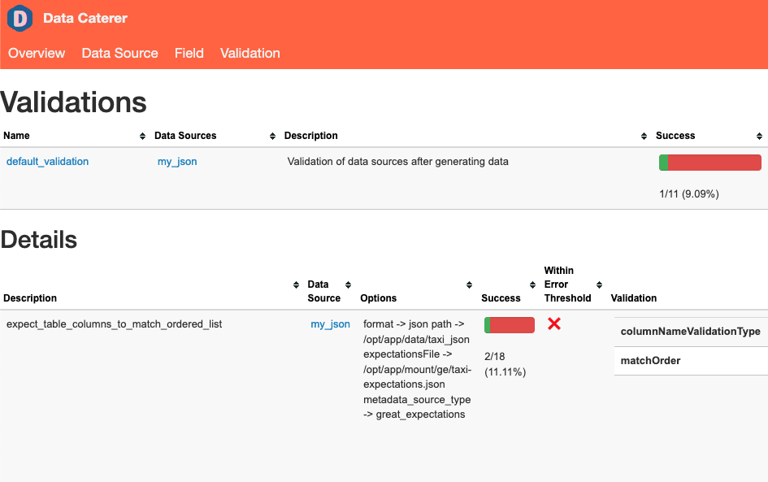

# Great Expectations Source

Creating a data generator for a JSON file and validating the data based on expectations 
in [Great Expectations](https://github.com/great-expectations/great_expectations).

## Requirements

- 10 minutes
- Git
- Gradle
- Docker

## Get Started

First, we will clone the data-caterer-example repo which will already have the base project setup required.

=== "Java"

    ```shell
    git clone git@github.com:data-catering/data-caterer-example.git
    ```

=== "Scala"

    ```shell
    git clone git@github.com:data-catering/data-caterer-example.git
    ```

=== "YAML"

    ```shell
    git clone git@github.com:data-catering/data-caterer-example.git
    ```

=== "UI"

    [Run Data Caterer UI via the 'Quick Start' found here.](../../../../get-started/quick-start.md)

### Great Expectations Setup

A sample expectations file that will be used for this guide can be found 
[**here**](https://github.com/data-catering/data-caterer-example/tree/main/docker/mount/ge/taxi-expectations.json).

If you want to use your own expectations file, simply add it into the `docker/mount/ge` folder path and follow the below
steps.

### Plan Setup

Create a file depending on which interface you want to use.

- Java: `src/main/java/io/github/datacatering/plan/MyAdvancedGreatExpectationsJavaPlanRun.java`
- Scala: `src/main/scala/io/github/datacatering/plan/MyAdvancedGreatExpectationsPlanRun.scala`
- YAML: `docker/data/custom/plan/my-great-expectations.yaml`

=== "Java"

    ```java
    import io.github.datacatering.datacaterer.java.api.PlanRun;
    ...
    
    public class MyAdvancedGreatExpectationsJavaPlanRun extends PlanRun {
        {
            var conf = configuration().enableGenerateValidations(true)
                .generatedReportsFolderPath("/opt/app/data/report");
        }
    }
    ```

=== "Scala"

    ```scala
    import io.github.datacatering.datacaterer.api.PlanRun
    ...
    
    class MyAdvancedGreatExpectationsPlanRun extends PlanRun {
      val conf = configuration.enableGenerateValidations(true)
        .generatedReportsFolderPath("/opt/app/data/report")
    }
    ```


=== "YAML"

    In `docker/data/custom/plan/my-great-expectations.yaml`:
    ```yaml
    name: "my_great_expectations_plan"
    description: "Create account data in JSON format and validate via Great Expectations metadata"
    tasks:
      - name: "json_task"
        dataSourceName: "my_json"
    ```

    In `docker/data/custom/application.conf`:
    ```
    flags {
      enableGenerateValidations = true
    }
    folders {
      generatedReportsFolderPath = "/opt/app/data/report"
    }
    ```

=== "UI"

    1. Click on `Advanced Configuration` towards the bottom of the screen
    1. Click on `Flag` and click on `Generate Validations`
    1. Click on `Folder` and enter `/tmp/data-caterer/report` for `Generated Reports Folder Path`

We will enable generate validations so that we can read from external sources for validations and save the reports
under a folder we can easily access.

#### Great Expectations

To point to a specific expectations file, we create a metadata source as seen below.

=== "Java"

    ```java
    var greatExpectationsSource = metadataSource().greatExpectations("/opt/app/mount/ge/taxi-expectations.json");
    ```

=== "Scala"

    ```scala
    val greatExpectationsSource = metadataSource.greatExpectations("/opt/app/mount/ge/taxi-expectations.json")
    ```

=== "YAML"

    In `docker/data/custom/task/file/json/json-great-expectations-task.yaml`:
    ```yaml
    name: "json_task"
    steps:
      - name: "accounts"
        type: "json"
        options:
          path: "/opt/app/data/json"
          metadataSourceType: "greatExpectations"
          expectationsFile: "/opt/app/mount/ge/taxi-expectations.json"
    ```

=== "UI"

    1. Click on `Connection` tab at the top
    1. Select `Great Expectations` as the data source and enter `my-great-expectations`
    1. Copy [this file](https://github.com/data-catering/data-caterer-example/blob/main/docker/mount/ge/taxi-expectations.json) into `/tmp/ge/taxi-expectations.json`
    1. Enter `/tmp/ge/taxi-expectations.json` as the `Expectations File`

#### Schema & Validation

To simulate a scenario where we have an existing data source, we will manually create a sample dataset.
  
At the end, we point to our expectations metadata source to use those validations to validate the data.

=== "Java"

    ```java
    var jsonTask = json("my_json", "/opt/app/data/json", Map.of("saveMode", "overwrite"))
            .fields(
                    field().name("vendor_id"),
                    field().name("pickup_datetime").type(TimestampType.instance()),
                    field().name("dropoff_datetime").type(TimestampType.instance()),
                    field().name("passenger_count").type(IntegerType.instance()),
                    field().name("trip_distance").type(DoubleType.instance()),
                    field().name("rate_code_id"),
                    field().name("store_and_fwd_flag"),
                    field().name("pickup_location_id"),
                    field().name("dropoff_location_id"),
                    field().name("payment_type"),
                    field().name("fare_amount").type(DoubleType.instance()),
                    field().name("extra"),
                    field().name("mta_tax").type(DoubleType.instance()),
                    field().name("tip_amount").type(DoubleType.instance()),
                    field().name("tolls_amount").type(DoubleType.instance()),
                    field().name("improvement_surcharge").type(DoubleType.instance()),
                    field().name("total_amount").type(DoubleType.instance()),
                    field().name("congestion_surcharge").type(DoubleType.instance())
            )
            .validations(greatExpectations);
    ```

=== "Scala"

    ```scala
    val jsonTask = json("my_json", "/opt/app/data/taxi_json", Map("saveMode" -> "overwrite"))
      .fields(
        field.name("vendor_id"),
        field.name("pickup_datetime").`type`(TimestampType),
        field.name("dropoff_datetime").`type`(TimestampType),
        field.name("passenger_count").`type`(IntegerType),
        field.name("trip_distance").`type`(DoubleType),
        field.name("rate_code_id"),
        field.name("store_and_fwd_flag"),
        field.name("pickup_location_id"),
        field.name("dropoff_location_id"),
        field.name("payment_type"),
        field.name("fare_amount").`type`(DoubleType),
        field.name("extra"),
        field.name("mta_tax").`type`(DoubleType),
        field.name("tip_amount").`type`(DoubleType),
        field.name("tolls_amount").`type`(DoubleType),
        field.name("improvement_surcharge").`type`(DoubleType),
        field.name("total_amount").`type`(DoubleType),
        field.name("congestion_surcharge").`type`(DoubleType),
      )
      .validations(greatExpectationsSource)
    ```

=== "YAML"

    In `docker/data/custom/task/json/json-great-expectations-task.yaml`:
    ```yaml
    name: "json_task"
    steps:
      - name: "accounts"
        type: "json"
        options:
          path: "/opt/app/data/json"
          metadataSourceType: "greatExpectations"
          expectationsFile: "/opt/app/mount/ge/taxi-expectations.json"
        fields:
          - name: "vendor_id"
          - name: "pickup_datetime"
            type: "timestamp"
          - name: "dropoff_datetime"
            type: "timestamp"
          - name: "passenger_count"
            type: "integer"
          - name: "trip_distance"
            type: "double"
          - name: "rate_code_id"
          - name: "store_and_fwd_flag"
          - name: "pickup_location_id"
          - name: "dropoff_location_id"
          - name: "payment_type"
          - name: "fare_amount"
            type: "double"
          - name: "extra"
          - name: "mta_tax"
            type: "double"
          - name: "tip_amount"
            type: "double"
          - name: "tolls_amount"
            type: "double"
          - name: "improvement_surcharge"
            type: "double"
          - name: "total_amount"
            type: "double"
          - name: "congestion_surcharge"
            type: "double"
    ```

=== "UI"

    1. Click on `Generation` and tick the `Manual` checkbox
    1. Click on `+ Field`
    1. Add name as `vendor_id`
    1. Click on `Select data type` and select `string`
    1. Continue with other fields and data types

### Run

Let's try run and see what happens.

```shell
cd ..
./run.sh
#input class MyAdvancedGreatExpectationsJavaPlanRun or MyAdvancedGreatExpectationsPlanRun
#after completing
#open docker/sample/report/index.html
```

=== "Java"

    ```shell
    ./run.sh MyAdvancedGreatExpectationsJavaPlanRun
    #open docker/sample/report/index.html
    ```

=== "Scala"

    ```shell
    ./run.sh MyAdvancedGreatExpectationsPlanRun
    #open docker/sample/report/index.html
    ```

=== "YAML"

    ```shell
    ./run.sh my-great-expectations.yaml
    #open docker/sample/report/index.html
    ```

=== "UI"

    1. Click the button `Execute` at the top
    1. Progress updates will show in the bottom right corner
    1. Click on `History` at the top
    1. Check for your plan name and see the result summary
    1. Click on `Report` on the right side to see more details of what was executed

It should look something like this.



So we were just able to validate our data source from reading a Great Expectations file. Simple!
This gives us an easy way to integrate with existing data validations, but now we can relate that to
generated data in test environments.
  
But we still may want to add on our own validations outside what is in Great Expectations.

### Custom validation

We found that we should also check that the `trip_distance` has to be less than `500` but was not included in Great
Expectations. No worries, we can simply add it in here alongside the existing expectations.

=== "Java"

    ```java
    var jsonTask = json("my_json", "/opt/app/data/json", Map.of("saveMode", "overwrite"))
            .fields(
                ...
            ))
            .validations(greatExpectations)
            .validations(validation().field("trip_distance").lessThan(500));
    ```

=== "Scala"

    ```scala
    val jsonTask = json("my_json", "/opt/app/data/json", Map("saveMode" -> "overwrite"))
      .fields(
        ...
      ))
      .validations(greatExpectationsSource)
      .validations(validation.field("trip_distance").lessThan(500))
    ```

=== "YAML"

    In `docker/data/custom/validation/great-expectations-validation.yaml`:
    ```yaml
    ---
    name: "ge_checks"
    dataSources:
      my_json:
        - validations:
            - expr: "trip_distance < 500"
            - field: "trip_distance"  #OR
              validation:
                - type: "lessThan"
                  value: 500
    ```

=== "UI"

    1. Under `Validation`, click on `Manual`
    1. Click on `+ Validation` and go to `Select validation type...` as `Field`
    1. Set `Field` to `trip_distance`
    1. Click on `+` next to the field name and select `Less Than`
    1. Enter `500` as the value

Let's test it out by running it again.


Check out the full example under `GreatExpectationsPlanRun` in the example repo.
