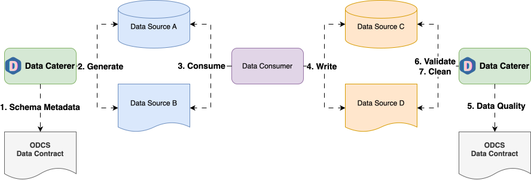

# Open Data Contract Standard (ODCS) Source



Create data generators and validators using metadata from [Open Data Contract Standard (ODCS)](https://github.com/bitol-io/open-data-contract-standard) files.

Data Caterer supports both ODCS v2.x and v3.x formats, automatically extracting:

- **Schema information** - field names, data types, constraints
- **Generation constraints** - min/max values, patterns, formats, examples
- **Data quality rules** - validation checks defined in ODCS v3.x contracts

[:material-run-fast: Scala Example](https://github.com/data-catering/data-caterer/blob/main/example/src/main/scala/io/github/datacatering/plan/ODCSPlanRun.scala)

## Requirements

- 10 minutes
- Git
- Gradle
- Docker

## Get Started

First, we will clone the data-caterer repo which will already have the base project setup required.

=== "Java"

    ```shell
    git clone git@github.com:data-catering/data-caterer.git
    cd data-caterer/example
    ```

=== "Scala"

    ```shell
    git clone git@github.com:data-catering/data-caterer.git
    cd data-caterer/example
    ```

=== "YAML"

    ```shell
    git clone git@github.com:data-catering/data-caterer.git
    cd data-caterer/example
    ```

=== "UI"

    [Run Data Caterer UI via the 'Quick Start' found here.](../../../../get-started/quick-start.md)

### Open Data Contract Standard (ODCS) Setup

We will be using
[the following ODCS file](https://github.com/data-catering/data-caterer/blob/main/example/docker/mount/odcs/full-example.odcs.yaml)
for this example.

### Plan Setup

Create a new Java/Scala class or YAML file.

- Java: `src/main/java/io/github/datacatering/plan/MyAdvancedODCSJavaPlanRun.java`
- Scala: `src/main/scala/io/github/datacatering/plan/MyAdvancedODCSPlanRun.scala`
- YAML: `docker/data/customer/plan/my-odcs.yaml`

Make sure your class extends `PlanRun`.

=== "Java"

    ```java
    import io.github.datacatering.datacaterer.java.api.PlanRun;
    ...

    public class MyAdvancedODCSJavaPlanRun extends PlanRun {
        {
            var conf = configuration().enableGeneratePlanAndTasks(true)
                .generatedReportsFolderPath("/opt/app/data/report");
        }
    }
    ```

=== "Scala"

    ```scala
    import io.github.datacatering.datacaterer.api.PlanRun
    ...

    class MyAdvancedODCSPlanRun extends PlanRun {
      val conf = configuration.enableGeneratePlanAndTasks(true)
        .generatedReportsFolderPath("/opt/app/data/report")
    }
    ```

=== "YAML"

    In `docker/data/custom/plan/my-odcs.yaml`:
    ```yaml
    name: "my_odcs_plan"
    description: "Create account data in CSV via ODCS metadata"
    tasks:
      - name: "csv_account_file"
        dataSourceName: "customer_accounts"
    ```

    In `docker/data/custom/application.conf`:
    ```
    flags {
      enableUniqueCheck = true
    }
    folders {
      generatedReportsFolderPath = "/opt/app/data/report"
    }
    ```

=== "UI"

    1. Click on `Advanced Configuration` towards the bottom of the screen
    2. Click on `Flag` and click on `Unique Check`
    3. Click on `Folder` and enter `/tmp/data-caterer/report` for `Generated Reports Folder Path`

We will enable generate plan and tasks so that we can read from external sources for metadata and save the reports
under a folder we can easily access.

#### Schema

We can point the schema of a data source to our Open Data Contract Standard (ODCS) file.

=== "Java"

    ```java
    var accountTask = csv("my_csv", "/opt/app/data/account-odcs", Map.of("header", "true"))
            .fields(metadataSource().openDataContractStandard("/opt/app/mount/odcs/full-example.yaml"))
            .count(count().records(100));
    ```

=== "Scala"

    ```scala
    val accountTask = csv("customer_accounts", "/opt/app/data/customer/account-odcs", Map("header" -> "true"))
      .fields(metadataSource.openDataContractStandard("/opt/app/mount/odcs/full-example.yaml"))
      .count(count.records(100))
    ```

=== "YAML"

    In `docker/data/custom/task/file/csv/csv-odcs-account-task.yaml`:
    ```yaml
    name: "csv_account_file"
    steps:
      - name: "accounts"
        type: "csv"
        options:
          path: "/opt/app/data/csv/account-odcs"
          metadataSourceType: "openDataContractStandard"
          dataContractFile: "/opt/app/mount/odcs/full-example.yaml"
        count:
          records: 100
    ```

=== "UI"

    1. Click on `Connection` tab at the top
    1. Select `ODCS` as the data source and enter `example-odcs`
    1. Copy [this file](https://github.com/data-catering/data-caterer/blob/main/example/docker/mount/odcs/full-example.yaml) into `/tmp/odcs/full-example.yaml`
    1. Enter `/tmp/odcs/full-example.yaml` as the `Contract File`

The above defines that the schema will come from Open Data Contract Standard (ODCS), which is a type of metadata source
that contains information about schemas.
[Specifically, it points to the schema provided here](https://github.com/data-catering/data-caterer/blob/main/example/docker/mount/odcs/full-example.yaml#L42)
in the `docker/mount/odcs` folder of data-caterer repo.

### Run

Let's try run and see what happens.

=== "Java"

    ```shell
    ./run.sh MyAdvancedODCSJavaPlanRun
    head docker/sample/customer/account-odcs/part-00000-*
    ```

=== "Scala"

    ```shell
    ./run.sh MyAdvancedODCSPlanRun
    head docker/sample/customer/account-odcs/part-00000-*
    ```

=== "YAML"

    ```shell
    ./run.sh my-odcs.yaml
    head docker/sample/customer/account-odcs/part-00000-*
    ```

=== "UI"

    1. Click on `Execute` at the top
    ```shell
    head /tmp/data-caterer/customer/account-odcs/part-00000*
    ```

It should look something like this.

```
txn_ref_dt,rcvr_id,rcvr_cntry_code
2023-07-11,PB0Wo dMx,nWlbRGIinpJfP
2024-05-01,5GtkNkHfwuxLKdM,1a
2024-05-01,OxuATCLAUIhHzr,gSxn2ct
2024-05-22,P4qe,y9htWZhyjW
```

Looks like we have some data now. But we can do better and add some enhancements to it.

### Custom metadata

We can see from the data generated, that it isn't quite what we want. Sometimes, the metadata is not sufficient for us
to produce production-like data yet, and we want to manually edit it. Let's try to add some enhancements to it.

Let's make the `rcvr_id` field follow the regex `RC[0-9]{8}` and the field `rcvr_cntry_code` should only be one of
either `AU, US or TW`. For the full guide on data generation options,
[check the following page](../../scenario/data-generation.md).

=== "Java"

    ```java
    var accountTask = csv("my_csv", "/opt/app/data/account-odcs", Map.of("header", "true"))
                .fields(metadata...)
                .fields(
                    field().name("rcvr_id").regex("RC[0-9]{8}"),
                    field().name("rcvr_cntry_code").oneOf("AU", "US", "TW")
                )
                .count(count().records(100));
    ```

=== "Scala"

    ```scala
    val accountTask = csv("customer_accounts", "/opt/app/data/customer/account-odcs", Map("header" -> "true"))
      .fields(metadata...)
      .fields(
        field.name("rcvr_id").regex("RC[0-9]{8}"),
        field.name("rcvr_cntry_code").oneOf("AU", "US", "TW")
      )
      .count(count.records(100))
    ```

=== "YAML"

    In `docker/data/custom/task/file/csv/csv-odcs-account-task.yaml`:
    ```yaml
    name: "csv_account_file"
    steps:
      - name: "accounts"
        type: "csv"
        options:
          path: "/opt/app/data/csv/account-odcs"
          metadataSourceType: "openDataContractStandard"
          dataContractFile: "/opt/app/mount/odcs/full-example.yaml"
        count:
          records: 100
        fields:
          - name: "rcvr_id"
            options:
              regex: "RC[0-9]{8}"
          - name: "rcvr_cntry_code"
            options:
              oneOf:
                - "AU"
                - "US"
                - "TW"
    ```

=== "UI"

    1. Click on `Generation` and tick the `Manual` checkbox
    1. Click on `+ Field`
        1. Go to `rcvr_id` field
        1. Click on `+` dropdown next to `string` data type
        1. Click `Regex` and enter `RC[0-9]{8}`
    1. Click on `+ Field`
        1. Go to `rcvr_cntry_code` field
        1. Click on `+` dropdown next to `string` data type
        1. Click `One Of` and enter `AU,US,TW`

Let's test it out by running it again

=== "Java"

    ```shell
    ./run.sh MyAdvancedODCSJavaPlanRun
    head docker/sample/customer/account-odcs/part-00000-*
    ```

=== "Scala"

    ```shell
    ./run.sh MyAdvancedODCSPlanRun
    head docker/sample/customer/account-odcs/part-00000-*
    ```

=== "YAML"

    ```shell
    ./run.sh my-odcs.yaml
    head docker/sample/customer/account-odcs/part-00000-*
    ```

=== "UI"

    1. Click on `Execute` at the top
    ```shell
    head /tmp/data-caterer/customer/account-odcs/part-00000*
    ```

```
txn_ref_dt,rcvr_id,rcvr_cntry_code
2024-02-15,RC02579393,US
2023-08-18,RC14320425,AU
2023-07-07,RC17915355,TW
2024-06-07,RC47347046,TW
```

Great! Now we have the ability to get schema information from an external source, add our own metadata and generate
data.

## What Metadata is Extracted

Data Caterer extracts different metadata depending on the ODCS version:

### All Versions (v2.x and v3.x)

- **Field names and types** - Basic schema structure
- **Primary keys** - Including composite keys with position
- **Nullable/required fields** - Whether fields can be null
- **Unique constraints** - Fields that must have unique values

### ODCS v3.x Additional Features

#### Generation Constraints

From `logicalTypeOptions`:

- **String constraints**:
  - `minLength` / `maxLength` - String length bounds
  - `pattern` - Regex patterns for string generation
  - `format` - Format hints (email, uuid, uri, hostname, ipv4, ipv6)
- **Numeric constraints**:
  - `minimum` / `maximum` - Numeric value bounds
- **Examples** - Sample values (stored for reference, not used for generation)
- **Classification** - Data sensitivity levels (public, restricted, confidential)

#### Data Quality Validations

From the `quality` array, Data Caterer automatically converts ODCS quality checks to validations:

- **Library rules** - Built-in checks:
  - `nullCheck` - Ensures fields are not null
  - `uniqueCheck` - Validates field uniqueness
  - `countCheck` - Row count validations (with range support)
  - `betweenCheck` - Value range validations
  - `matchesPattern` - Regex pattern matching
- **SQL rules** - Custom SQL expressions for complex validations
- **Custom rules** - Vendor-specific quality implementations
- **Severity levels** - Automatic error thresholds based on severity:
  - `error` = strict validation (no failures allowed)
  - `warning`/`info` = lenient (up to 5% failures allowed)

### Data Validation

To enable automatic validation from ODCS quality rules, set `enableGenerateValidations` in configuration:

=== "Java"

    ```java
    var conf = configuration().enableGeneratePlanAndTasks(true)
        .enableGenerateValidations(true)
        .generatedReportsFolderPath("/opt/app/data/report");

    execute(conf, accountTask);
    ```

=== "Scala"

    ```scala
    val conf = configuration.enableGeneratePlanAndTasks(true)
      .enableGenerateValidations(true)
      .generatedReportsFolderPath("/opt/app/data/report")

    execute(conf, accountTask)
    ```

=== "YAML"

    In `docker/data/custom/application.conf`:
    ```
    flags {
      enableGenerateValidations = true
    }
    ```

=== "UI"

    1. Click on `Advanced Configuration` towards the bottom of the screen
    2. Click on `Flag` and click on `Generate Validations`

[For more details on validation options, check this link.](../../../validation.md)

## Example ODCS Contract

Here's a minimal ODCS v3 contract showing the key features:

```yaml
apiVersion: v3.0.0
kind: DataContract
id: my-data-contract
version: 1.0.0
status: active

schema:
  - name: users
    physicalName: users_table
    properties:
      - name: user_id
        logicalType: integer
        physicalType: bigint
        primaryKey: true
        required: true
        unique: true
        quality:
          - type: library
            rule: uniqueCheck
            dimension: uniqueness
            severity: error

      - name: email
        logicalType: string
        physicalType: varchar(255)
        required: true
        classification: restricted
        logicalTypeOptions:
          pattern: "^[a-zA-Z0-9._%+-]+@[a-zA-Z0-9.-]+\\.[a-zA-Z]{2,}$"
          minLength: 5
          maxLength: 255
        examples:
          - "user@example.com"
          - "test@test.com"
        quality:
          - type: library
            rule: nullCheck
            dimension: completeness
            severity: error

      - name: age
        logicalType: integer
        physicalType: int
        required: false
        logicalTypeOptions:
          minimum: 18
          maximum: 120
        quality:
          - type: library
            rule: betweenCheck
            mustBeBetween: [18, 120]
            dimension: accuracy
            severity: warning

    quality:
      - type: library
        rule: countCheck
        mustBeGreaterThan: 0
        dimension: completeness
        severity: error
```

Check out the full example under `ODCSPlanRun` in the [example repo](https://github.com/data-catering/data-caterer/blob/main/example/src/main/scala/io/github/datacatering/plan/ODCSPlanRun.scala).

## Supported vs Unsupported Features

### ✅ Supported in Data Caterer

**From ODCS Contract:**

- Schema structure (names, types)
- Primary keys (simple and composite)
- Required/nullable fields
- Unique constraints
- String constraints (minLength, maxLength, pattern, format)
- Numeric constraints (minimum, maximum)
- Examples (stored as metadata)
- Classification (stored as metadata)
- Quality checks → Validations (nullCheck, uniqueCheck, countCheck, betweenCheck, matchesPattern)
- SQL-based quality rules
- Severity-based validation thresholds

### ❌ Not Currently Supported

- Object constraints (minProperties, maxProperties, required)
- Relationships/foreign keys (architectural limitation)
- Custom quality rules (vendor-specific implementations)

## Tips for Best Results

1. **Use ODCS v3.x** for full feature support including quality validations
2. **Include logicalTypeOptions** for better data generation (patterns, min/max values)
3. **Add quality checks** to automatically validate generated data
4. **Combine with manual overrides** - ODCS provides the baseline, you can enhance specific fields
5. **Use examples for documentation** - they help users understand expected values but don't constrain generation
