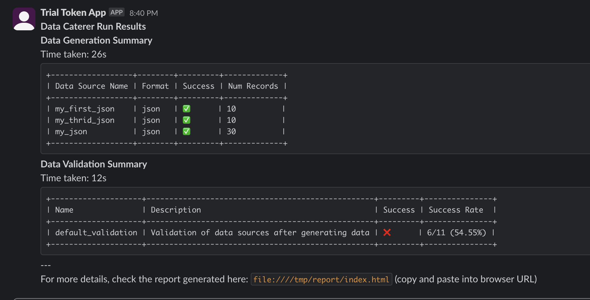

# Alert

Alerts can be configured to help users receive feedback from their data testing results. Currently, Data Caterer 
supports Slack for alerts.

## Slack

Define a [Slack token](https://api.slack.com/authentication/token-types) and one or more Slack channels that will 
receive an alert like the below.



=== "Java"

    ```java
    var conf = configuration()
        .slackAlertToken("abc123")                                //use appropriate Slack token (usually bot token)
        .slackAlertChannels("#test-alerts", "#pre-prod-testing"); //define Slack channel(s) to receive alerts on

    execute(conf, ...);
    ```

=== "Scala"

    ```scala
    val conf = configuration
      .slackAlertToken("abc123")                                //use appropriate Slack token (usually bot token)
      .slackAlertChannels("#test-alerts", "#pre-prod-testing")  //define Slack channel(s) to receive alerts on

    execute(conf, ...)
    ```

=== "application.conf"

    ```
    flags {
      enableAlerts = true
    }
    alerts {
      triggerOn = "onFailure"  # onFailure | onCompletion | always
      slack {
        token = "abc123"
        channels = ["#test-alerts", "#pre-prod-testing"]
      }
    }
    ```

### Trigger conditions

Control when alerts are sent based on execution results.

=== "Java"

    ```java
    configuration()
      .enableAlerts(true)
      .alertTriggerOn("onFailure"); // options: onFailure | onCompletion | always
    ```

=== "Scala"

    ```scala
    configuration
      .enableAlerts(true)
      .alertTriggerOn("onFailure") // options: onFailure | onCompletion | always
    ```
    
=== "application.conf"

    ```
    flags {
      enableAlerts = true
    }
    alerts {
      triggerOn = "onFailure"  # onFailure | onCompletion | always
    }
    ```


