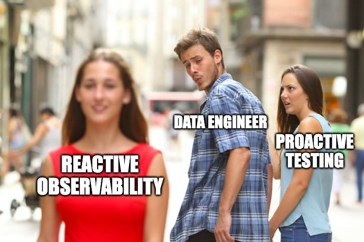

# Rethinking "Shift-Left" for Data Pipelines: How to Fix Issues Before They Crash the Party

You know that feeling when you’re cooking dinner, and instead of waiting for your guests to complain about a burnt dish,
you taste it along the way to make sure everything’s perfect? That’s what *shift-left* should be all about—catching
problems early rather than waiting for disaster to strike. But in the world of data pipelines, “shift-left” has been
thrown around so loosely that it’s lost its real meaning.

## The Misunderstanding: Data Observability ≠ Shift-Left

These days, many teams say they’re doing shift-left when they use data observability tools. And don’t get me wrong,
watching your data flow in production and getting real-time alerts is super useful. But here’s the thing: relying on
these tools is like waiting for a smoke alarm to go off before you start worrying about a fire. Sure, the alarm tells
you something’s wrong, but wouldn’t it be better if you had checked your stove before the kitchen went up in flames?

In other words, data observability in production is more of a “shift-right” move. It tells you about issues after
they’ve already happened, which isn’t really shifting quality assurance to the left of your development cycle.

## What Shift-Left Should Really Look Like

True shift-left is all about being proactive. Imagine if, before you even started cooking, you laid out all your
ingredients, read through the recipe, and prepped everything. That’s the idea here: catch the errors in your
data pipeline before they become a full-blown mess in production. Here’s how you can make that happen:

### 1. **Test in Your Local Kitchen (a.k.a. Local/Test Environments)**

Before you serve a dish at a dinner party (or push your data pipeline to production), you should test it out in a safe,
controlled environment. Think of it like doing a practice run:

- **Simulate Real Scenarios:** Just as you’d taste-test your food, simulate edge cases and error conditions to see how
  your pipeline behaves.
- **Practice with Contracts:** If you’re working with data from different sources, use contract tests to make sure
  everyone’s on the same page — like having a clear recipe that both the chef and cooks follow.

### 2. **Contract-Driven Data Pipelines: Your Recipe for Success**

Imagine if every time you cooked, you had a contract with your ingredients — “I promise to use only 150g of chicken” or
“I promise to preheat the oven to 375°F.” In data pipelines, a contract-driven approach means agreeing on a specific 
format and structure between the team that produces data and the one that consumes it. This way:

- **Everyone Knows What to Expect:** No more surprises when the dish (or data) arrives.
- **Automated Checks Keep Things Honest:** Just like checking a recipe before adding salt, automated tests ensure that
  changes in data or schema don’t break everything downstream.

### 3. **Simulate a Real Dinner Party (Production) in a Mini Version**

A good chef will always cook this dish for themselves before serving to their customers. It’s a great way to catch 
issues before the stakes are high. In data terms:

- **Generate Production-like Data:** Work with data sets in your test environment to mimic what happens in production.
- **Introduce Controlled “Surprises”:** Intentionally throw in some anomalies to see if your pipeline can handle
  unexpected situations—kind of like inviting a friend who always brings an odd dish to the party, just to see how
  everyone reacts.

## The Perks of Doing Shift-Left Right

When you really commit to shift-left, you’re not just avoiding fires in the kitchen — you’re making your whole process
smoother and more reliable. Here’s what you can expect:

- **Fewer Production Nightmares:** By catching issues early, you can avoid those costly, last-minute fixes.
- **Faster Iteration:** With robust pre-production testing, you can make changes confidently and quickly.
- **Less Stress, More Confidence:** Knowing that your data pipeline has been thoroughly checked before going live builds
  trust among your team and stakeholders.
- **Better Overall Quality:** Just like a well-planned meal, a shift-left approach ensures that every step of your
  process is aligned for success.

## Wrapping It Up

At its core, the idea of shift-left should be about stopping problems before they start—like checking your ingredients
before you begin cooking rather than scrambling to salvage a ruined meal. While data observability tools are essential,
they shouldn’t be the only line of defense. By being proactive with testing, using contract-driven pipelines, and
simulating production environments early on, you’re setting up your data processes for success.

So next time you hear someone talk about shift-left in data pipelines, ask yourself: Are we just watching for smoke, or
are we making sure the fire never starts?

