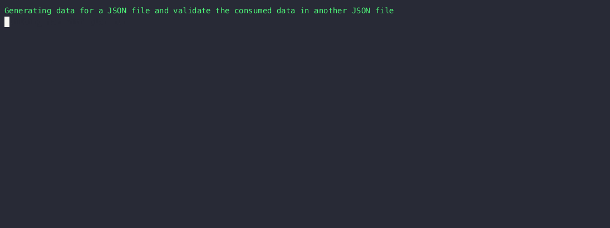
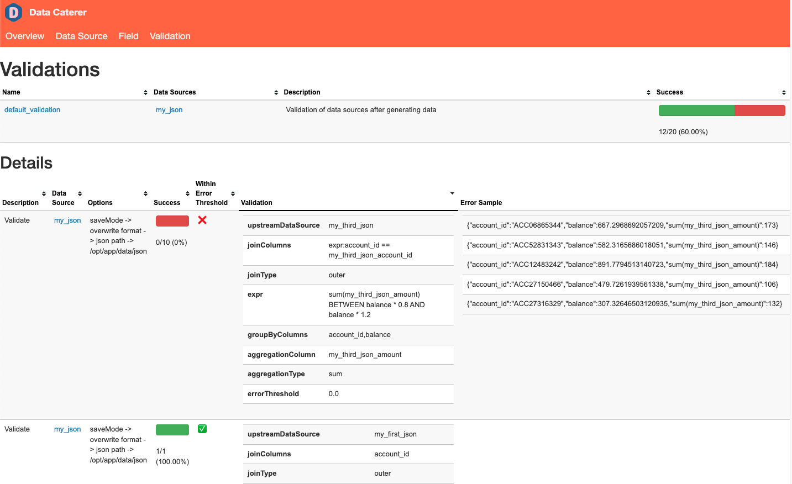

# Upstream Data Source Validation

If you want to run data validations based on data generated or data from another data source, you can use the upstream
data source validations. An example would be generating a Parquet file that gets ingested by a job and inserted into
Postgres. The validations can then check for each `account_id` generated in the Parquet, it exists in `account_number`
column in Postgres. The validations can be chained with basic and group by validations or even other upstream data
sources, to cover any complex validations.





## Basic join

Join across datasets by particular columns. Then run validations on the joined dataset. You will notice that the data
source name is appended onto the column names when joined (i.e. `my_first_json_customer_details`), to ensure column
names do not clash and make it obvious which columns are being validated.

In the below example, we check that the for the same `account_id`, then `customer_details.name` in the `my_first_json`
dataset should equal to the `name` column in the `my_second_json`.

=== "Java"

    ```java
    var firstJsonTask = json("my_first_json", "/tmp/data/first_json")
      .schema(
        field().name("account_id").regex("ACC[0-9]{8}"),
        field().name("customer_details")
          .schema(
            field().name("name").expression("#{Name.name}")
          )
      );

    var secondJsonTask = json("my_second_json", "/tmp/data/second_json")
      .validations(
        validation().upstreamData(firstJsonTask)                   //upstream data generation task is `firstJsonTask`
          .joinColumns("account_id")                               //use `account_id` column in both datasets to join corresponding records (outer join by default)
          .withValidation(
            validation().col("my_first_json_customer_details.name")
              .isEqualCol("name")                                  //validate the name in `my_second_json` is equal to `customer_details.name` in `my_first_json` when the `account_id` matches
          )
      );
    ```

=== "Scala"

    ```scala
    val firstJsonTask = json("my_first_json", "/tmp/data/first_json")
      .schema(
        field.name("account_id").regex("ACC[0-9]{8}"),
        field.name("customer_details")
          .schema(
            field.name("name").expression("#{Name.name}")
          )
      )

    val secondJsonTask = json("my_second_json", "/tmp/data/second_json")
      .validations(
        validation.upstreamData(firstJsonTask)                   //upstream data generation task is `firstJsonTask`
          .joinColumns("account_id")                             //use `account_id` column in both datasets to join corresponding records (outer join by default)
          .withValidation(
            validation.col("my_first_json_customer_details.name")
              .isEqualCol("name")                                //validate the name in `my_second_json` is equal to `customer_details.name` in `my_first_json` when the `account_id` matches
          )
      )
    ```

## Join expression

Define join expression to link two datasets together. This can be any SQL expression that returns a boolean value.
Useful in situations where join is based on transformations or complex logic.

In the below example, we have to use `CONCAT` SQL function to combine `'ACC'` and `account_number` to join with
`account_id` column in `my_first_json` dataset.

=== "Java"

    ```java
    var firstJsonTask = json("my_first_json", "/tmp/data/first_json")
      .schema(
        field().name("account_id").regex("ACC[0-9]{8}"),
        field().name("customer_details")
          .schema(
            field().name("name").expression("#{Name.name}")
          )
      );

    var secondJsonTask = json("my_second_json", "/tmp/data/second_json")
      .validations(
        validation().upstreamData(firstJsonTask)
          .joinExpr("my_first_json_account_id == CONCAT('ACC', account_number)")  //generic SQL expression that returns a boolean
          .withValidation(
            validation().col("my_first_json_customer_details.name")
              .isEqualCol("name")
          )
      );
    ```

=== "Scala"

    ```scala
    val firstJsonTask = json("my_first_json", "/tmp/data/first_json")
      .schema(
        field.name("account_id").regex("ACC[0-9]{8}"),
        field.name("customer_details")
          .schema(
            field.name("name").expression("#{Name.name}")
          )
      )

    val secondJsonTask = json("my_second_json", "/tmp/data/second_json")
      .validations(
        validation.upstreamData(firstJsonTask)
          .joinExpr("my_first_json_account_id == CONCAT('ACC', account_number)")  //generic SQL expression that returns a boolean
          .withValidation(
            validation.col("my_first_json_customer_details.name")
              .isEqualCol("name")
          )
      )
    ```

## Different join type

By default, an outer join is used to gather columns from both datasets together for validation. But there may be
scenarios where you want to control the join type.

Possible join types include:

- inner
- outer, full, fullouter, full_outer
- leftouter, left, left_outer
- rightouter, right, right_outer
- leftsemi, left_semi, semi
- leftanti, left_anti, anti
- cross

In the example below, we do an `anti` join by column `account_id` and check if there are no records. This essentially
checks that all `account_id`'s from `my_second_json` exist in `my_first_json`. The second validation also does something
similar but does an `outer` join (by default) and checks that the joined dataset has 30 records.

=== "Java"

    ```java
    var firstJsonTask = json("my_first_json", "/tmp/data/first_json")
      .schema(
        field().name("account_id").regex("ACC[0-9]{8}"),
        field().name("customer_details")
          .schema(
            field().name("name").expression("#{Name.name}")
          )
      );

    var secondJsonTask = json("my_second_json", "/tmp/data/second_json")
      .validations(
        validation().upstreamData(firstJsonTask)
          .joinColumns("account_id")
          .joinType("anti")
          .withValidation(validation().count().isEqual(0)),
        validation().upstreamData(firstJsonTask)
          .joinColumns("account_id")
          .withValidation(validation().count().isEqual(30))
      );
    ```

=== "Scala"

    ```scala
    val firstJsonTask = json("my_first_json", "/tmp/data/first_json")
      .schema(
        field.name("account_id").regex("ACC[0-9]{8}"),
        field.name("customer_details")
          .schema(
            field.name("name").expression("#{Name.name}")
          )
      )

    val secondJsonTask = json("my_second_json", "/tmp/data/second_json")
      .validations(
        validation.upstreamData(firstJsonTask)
          .joinColumns("account_id")
          .joinType("anti")
          .withValidation(validation.count().isEqual(0)),
        validation.upstreamData(firstJsonTask)
          .joinColumns("account_id")
          .withValidation(validation.count().isEqual(30))
      )
    ```

## Join then group by validation

We can apply aggregate or group by validations to the resulting joined dataset as the `withValidation` method accepts
any type of validation.

Here we group by `account_id, my_first_json_balance` to check that when the `amount` field is summed up per group, it is
between 0.8 and 1.2 times the balance.

=== "Java"

    ```java
    var firstJsonTask = json("my_first_json", "/tmp/data/first_json")
      .schema(
        field().name("account_id").regex("ACC[0-9]{8}"),
        field().name("balance").type(DoubleType.instance()).min(10).max(1000),
        field().name("customer_details")
          .schema(
            field().name("name").expression("#{Name.name}")
          )
      );

    var secondJsonTask = json("my_second_json", "/tmp/data/second_json")
      .validations(
        validation().upstreamData(firstJsonTask).joinColumns("account_id")
          .withValidation(
            validation().groupBy("account_id", "my_first_json_balance")
              .sum("amount")
              .betweenCol("my_first_json_balance * 0.8", "my_first_json_balance * 1.2")
          )
      );
    ```

=== "Scala"

    ```scala
    val firstJsonTask = json("my_first_json", "/tmp/data/first_json")
      .schema(
        field.name("account_id").regex("ACC[0-9]{8}"),
        field.name("balance").`type`(DoubleType).min(10).max(1000),
        field.name("customer_details")
          .schema(
            field.name("name").expression("#{Name.name}")
          )
      )

    val secondJsonTask = json("my_second_json", "/tmp/data/second_json")
      .validations(
        validation.upstreamData(firstJsonTask).joinColumns("account_id")
          .withValidation(
            validation.groupBy("account_id", "my_first_json_balance")
              .sum("amount")
              .betweenCol("my_first_json_balance * 0.8", "my_first_json_balance * 1.2")
          )
      )
    ```

## Chained validations

Given that the `withValidation` method accepts any other type of validation, you can chain other upstream data sources
with it. Here we will show a third upstream data source being checked to ensure 30 records exists after joining them
together by `account_id`.

=== "Java"

    ```java
    var firstJsonTask = json("my_first_json", "/tmp/data/first_json")
      .schema(
        field().name("account_id").regex("ACC[0-9]{8}"),
        field().name("balance").type(DoubleType.instance()).min(10).max(1000),
        field().name("customer_details")
          .schema(
            field().name("name").expression("#{Name.name}")
          )
      )
      .count(count().records(10));

    var thirdJsonTask = json("my_third_json", "/tmp/data/third_json")
      .schema(
        field().name("account_id"),
        field().name("amount").type(IntegerType.instance()).min(1).max(100),
        field().name("name").expression("#{Name.name}")
      )
      .count(count().records(10));

    var secondJsonTask = json("my_second_json", "/tmp/data/second_json")
      .validations(
        validation().upstreamData(firstJsonTask)
          .joinColumns("account_id")
          .withValidation(
            validation().upstreamData(thirdJsonTask)
              .joinColumns("account_id")
              .withValidation(validation().count().isEqual(30))
          )
      );
    ```

=== "Scala"

    ```scala
    val firstJsonTask = json("my_first_json", "/tmp/data/first_json")
      .schema(
        field.name("account_id").regex("ACC[0-9]{8}"),
        field.name("balance").`type`(DoubleType).min(10).max(1000),
        field.name("customer_details")
          .schema(
            field.name("name").expression("#{Name.name}")
          )
      )
      .count(count.records(10))
      
    val thirdJsonTask = json("my_third_json", "/tmp/data/third_json")
      .schema(
        field.name("account_id"),
        field.name("amount").`type`(IntegerType).min(1).max(100),
        field.name("name").expression("#{Name.name}"),
      )
      .count(count.records(10))

    val secondJsonTask = json("my_second_json", "/tmp/data/second_json")
      .validations(
        validation.upstreamData(firstJsonTask).joinColumns("account_id")
          .withValidation(
            validation.groupBy("account_id", "my_first_json_balance")
              .sum("amount")
              .betweenCol("my_first_json_balance * 0.8", "my_first_json_balance * 1.2")
          ),
      )
    ```

[Can check out a full example here for more details.](https://github.com/data-catering/data-caterer-example/blob/main/src/main/scala/com/github/pflooky/plan/ValidationPlanRun.scala)
