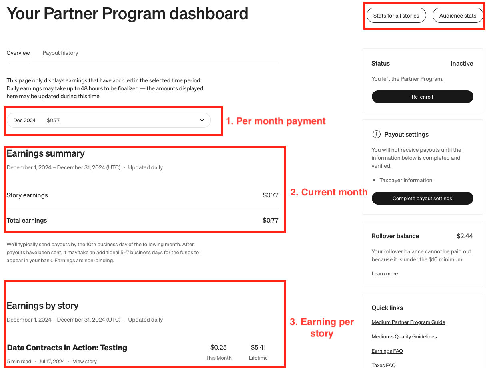
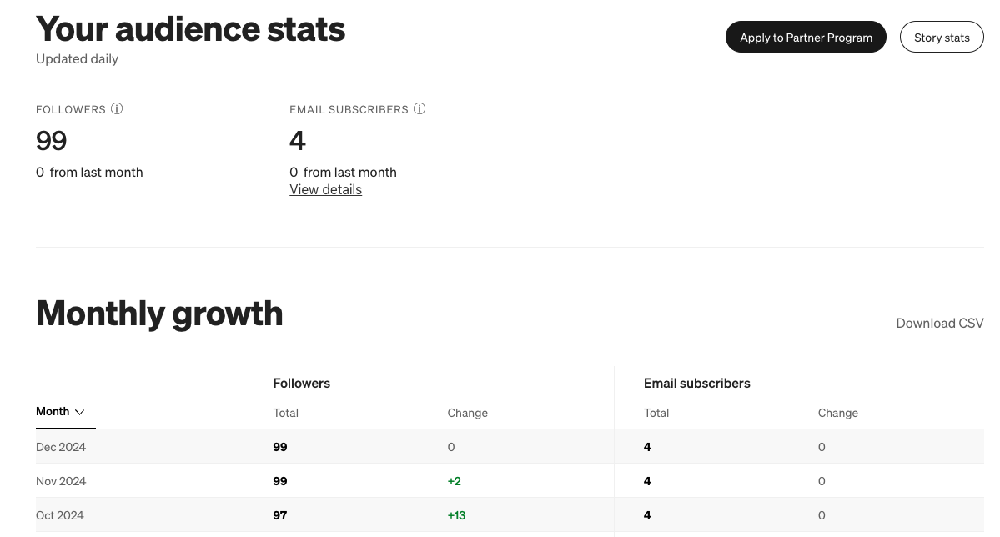
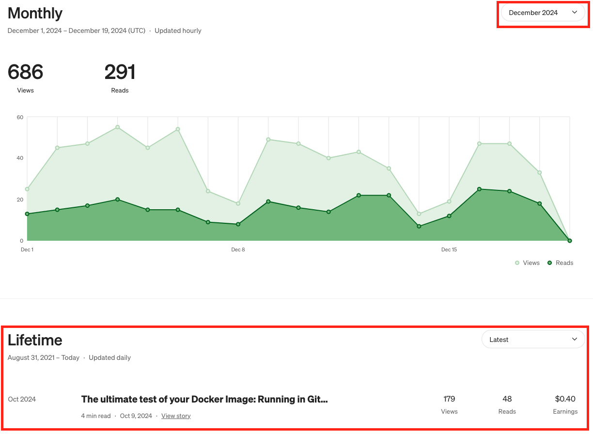
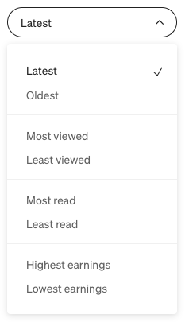
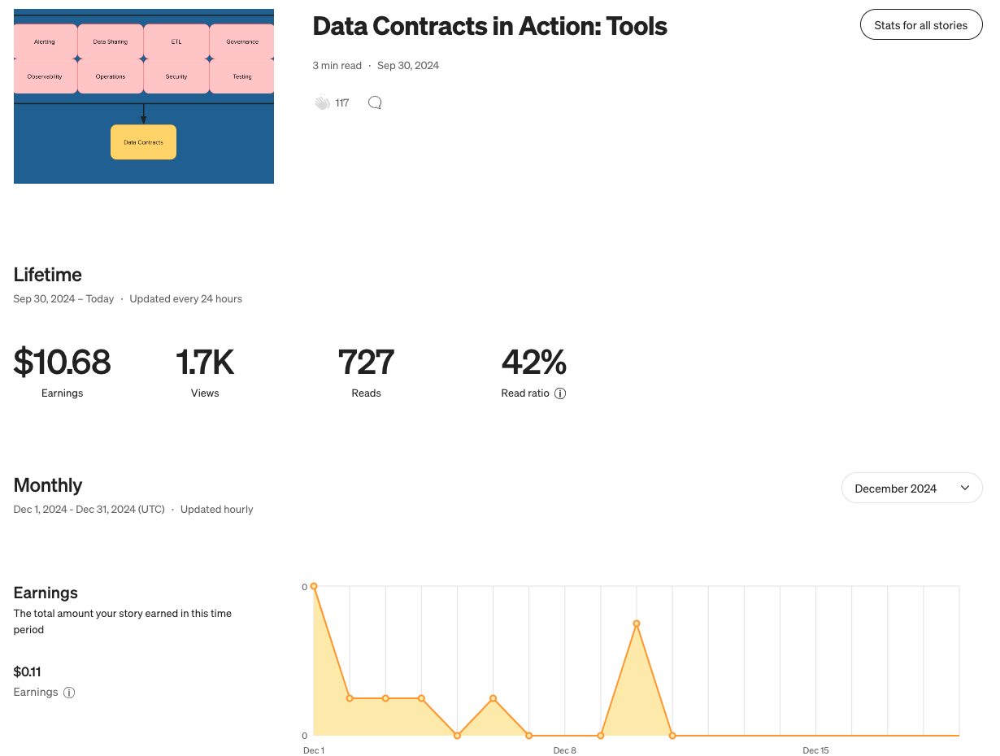
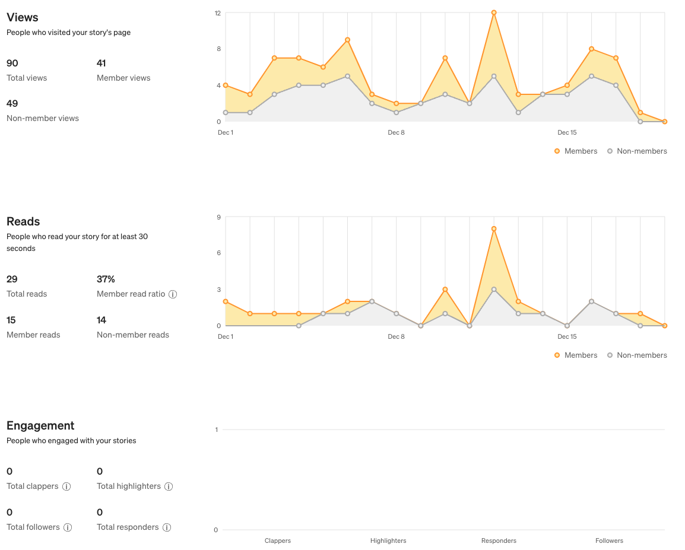
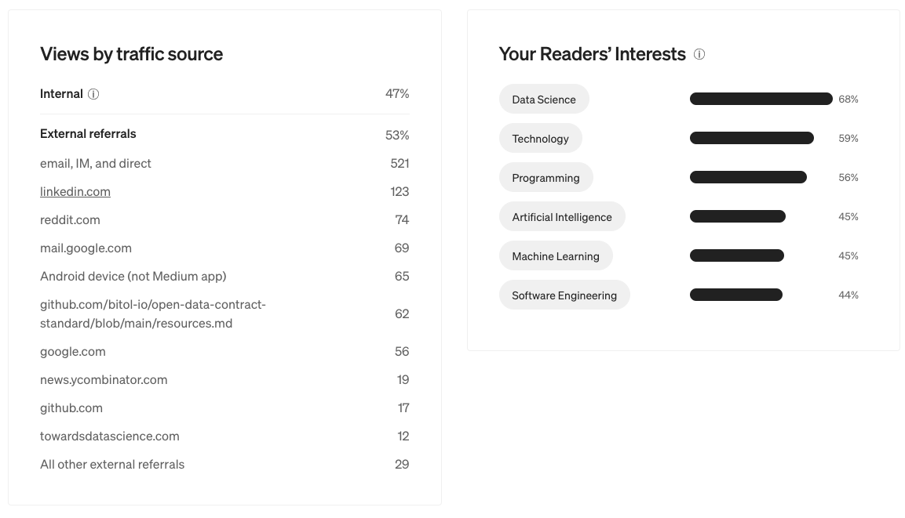
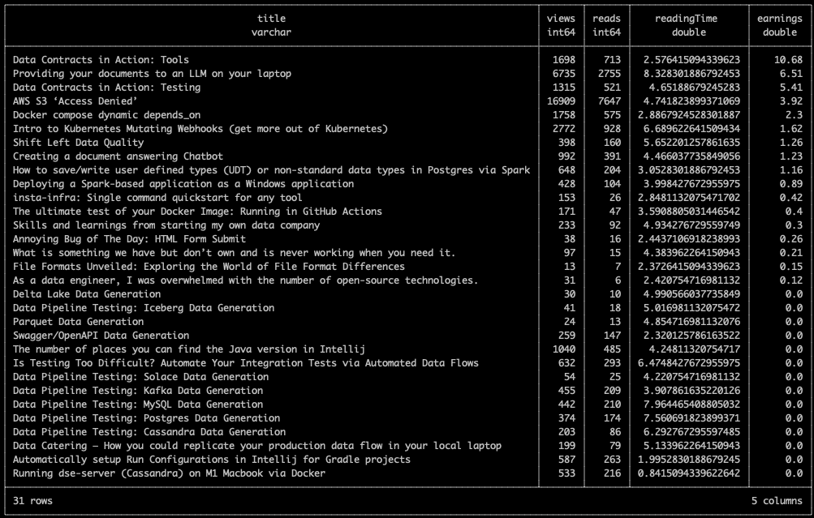
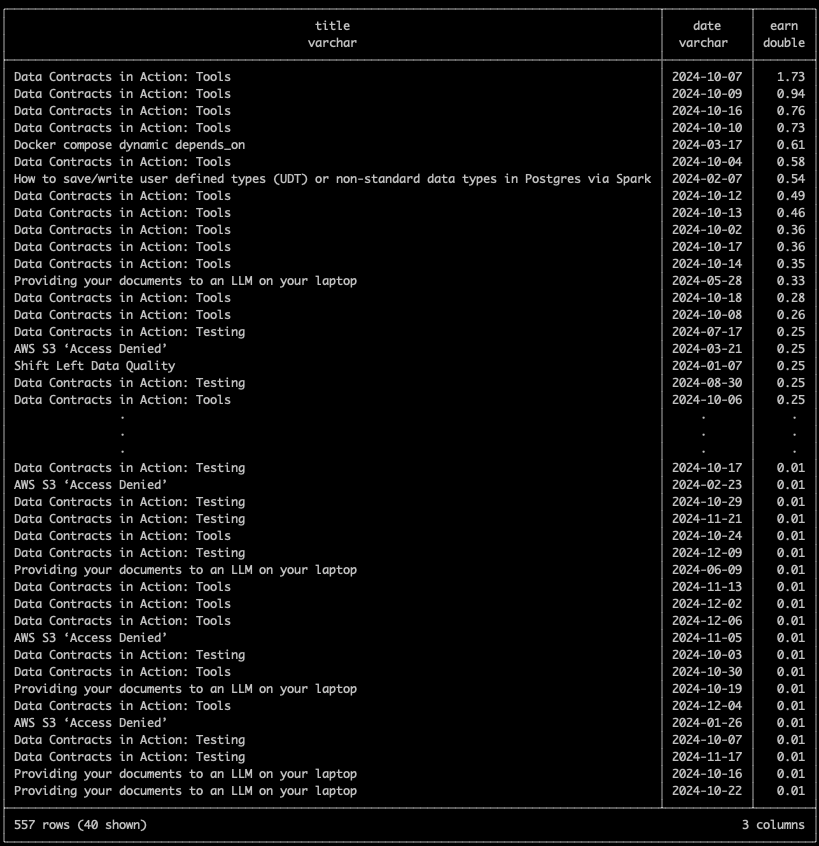
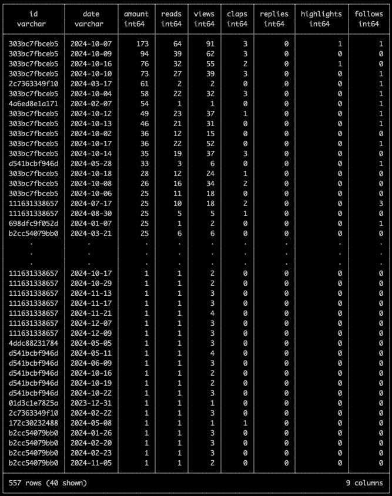

# A year of getting paid from Medium articles

## Creating Articles

At the end of last year, I decided to put more effort into creating articles both to help boost awareness of my
new business Data Catering and consolidate my knowledge and exploration of technology topics. I had been using
Medium for a couple of articles before and was enticed by the fact that you could monetize these articles via people
viewing, reading and reacting to what you have written. So I signed up to the Medium Partner Program for a year to
find out how much my articles are worth, hoping to at least break even at the end of it.

A small thing to note, Medium refers to articles as "stories". So wherever you see "story", just replace with article
as I'm not a story writer.

## Monetizing an Article

To earn money from an article, you have to restrict access to the article to only other members of the Medium Partner
Program. You have the option as a writer of the article to also share a friend's link which allows others to bypass this
restriction, but you don't earn anything based on the interactions from the friend's link.

So your only chances of earning from an article are essentially based on people outside your network, who are members,
interacting with your article.

## Medium Dashboards

You have access to a few dashboards which give you summary statistics on how users are interacting with your articles.

### Partner Program Dashboard

Shows you a summary of the current month earnings and gives you an overview on a per-story basis. Another thing to
note is that you now only get paid once you have reached $10 USD. Previously, you would get paid per month no matter
the amount.



### Audience Dashboard

An overview of subscribers to your articles. You can see a jump in October because I wrote an article that month.



### Story Dashboard

Details on how many people have viewed and read your articles.



Basic sorting options for story statistics.



### Per Story Dashboard

You can drill down into more details at the article level.



The breakdown of member/non-member reads and views per day.



The sources of traffic to your article and the interests of your readers.



## I Want More Insights

I wanted to run some further analysis on my article data. So I went searching for some export options within the Medium
website but could only find you can export out your [audience statistics](#audience-dashboard). Eventually, I found
something more comprehensive in [this GitHub repo called medium_stats](https://github.com/otosky/medium_stats). Great!

When I ran it after installing it via pip, it ran into a JSON decoding error. Most likely Medium has changed its API
and the project needs to be updated. Using my internet skills, I opened up "Inspect" in my browsers, went to the "
Network" tab and tried to find out which API call contains all the juicy information. After a few clicks, I found this
GraphQL response.


I could see the
[medium_stats project was already making some GraphQL calls](https://github.com/otosky/medium_stats/blob/master/medium_stats/scraper.py#L15).
So I quickly cloned the repo, added in the missing GraphQL calls and got it to kinda work. Now I have exported out my
stats in JSON format. How can we analyse this data quickly?

### DuckDB

Without putting too much thought into it, I knew I could easily use DuckDB to query this JSON data via SQL.
Now I can run queries like this to get a nice compact view of the stats I'm interested in.

#### Views, reads and earnings per story

```sql
SELECT node.title                                                                 AS title,
       node.totalStats.views                                                      AS views,
       node.totalStats.reads                                                      AS reads,
       node.readingTime,
       CAST(CONCAT(node.earnings.total.units, '.',
                   LEFT(CAST(node.earnings.total.nanos AS string), 2)) AS DOUBLE) AS earnings
FROM
    read_json('/tmp/stats_exports/*/agg_stats/*.json')
ORDER BY earnings DESC;
```



#### Earnings per day per story

```sql
SELECT a.node.title AS title, e.date AS date, e.total_earnings AS earn
FROM (SELECT d.id                                          AS id,
             STRFTIME(MAKE_TIMESTAMP(CAST(d.daily_earning.periodStartedAt AS BIGINT) * 1000),
                      '%Y-%m-%d')                          AS date,
             ROUND(SUM(d.daily_earning.amount / 100.0), 2) AS total_earnings
      FROM (SELECT p.post.id AS id, UNNEST(p.post.earnings.dailyEarnings) AS daily_earning
            FROM (SELECT UNNEST(data.post) AS post
                  FROM
                      read_json('/tmp/stats_exports/*/post_events/*.json')) p) d
      GROUP BY id,
               date) e
         JOIN read_json('/tmp/stats_exports/*/agg_stats/*.json') a ON a.node.id = e.id
ORDER BY earn DESC;
```



#### Earnings per member interaction per story

```sql
SELECT id,
       STRFTIME(MAKE_TIMESTAMP(CAST(earnings.periodStartedAt AS BIGINT) * 1000),
                '%Y-%m-%d')                                      AS date,
       earnings.amount                                           AS amount,
       stats.readersThatReadCount                                AS reads,
       stats.readersThatViewedCount                              AS views,
       stats.readersThatClappedCount                             AS claps,
       stats.readersThatRepliedCount                             AS replies,
       stats.readersThatHighlightedCount                         AS highlights,
       stats.readersThatInitiallyFollowedAuthorFromThisPostCount AS follows
FROM (SELECT d.id               AS id,
             d.stats            AS stats,
             UNNEST(d.earnings) AS earnings
      FROM (SELECT t.post.id                                   AS id,
                   t.post.earnings.dailyEarnings               AS earnings,
                   UNNEST(t.post.postStatsDailyBundle.buckets) AS stats
            FROM (SELECT UNNEST(data.post) AS post
                  FROM read_json('/tmp/stats_exports/*/post_earnings_breakdown/*.json')) t) d
      WHERE earnings NOT NULL AND stats.membershipType = 'MEMBER')
WHERE earnings.periodStartedAt = stats.dayStartsAt
ORDER BY amount DESC;
```



#### Linear regression of member interactions with earnings

I don't think I have enough data to get an accurate estimation of the formula used by Medium to calculate earnings but
the below query gives a rough indication. Someone else with a larger following could get a better estimate.

```sql
SELECT REGR_SLOPE(earnings.amount, stats.readersThatReadCount)                                AS slope_read,
       REGR_SLOPE(earnings.amount, stats.readersThatViewedCount)                              AS slope_view,
       REGR_SLOPE(earnings.amount, stats.readersThatClappedCount)                             AS slope_clap,
       REGR_SLOPE(earnings.amount, stats.readersThatRepliedCount)                             AS slope_reply,
       REGR_SLOPE(earnings.amount, stats.readersThatHighlightedCount)                         AS slope_highlight,
       REGR_SLOPE(earnings.amount, stats.readersThatInitiallyFollowedAuthorFromThisPostCount) AS slope_follow,
       REGR_INTERCEPT(earnings.amount, stats.readersThatReadCount)                            AS intercept
FROM (SELECT d.id               AS id,
             d.stats            AS stats,
             UNNEST(d.earnings) AS earnings
      FROM (SELECT t.post.id                                   AS id,
                   t.post.earnings.dailyEarnings               AS earnings,
                   UNNEST(t.post.postStatsDailyBundle.buckets) AS stats
            FROM (SELECT UNNEST(data.post) AS post
                  FROM read_json('/tmp/stats_exports/*/post_earnings_breakdown/*.json')) t) d
      WHERE earnings NOT NULL AND stats.membershipType = 'MEMBER')
WHERE earnings.periodStartedAt = stats.dayStartsAt;
```


## Did I Reach Break Even?

So I wasn't really expecting much out of it but was at least hoping to break even with my initial $50 USD investment.

### Total earnings across all articles

```sql
SELECT SUM(CAST(CONCAT(node.earnings.total.units, '.',
                       LEFT(CAST(node.earnings.total.nanos AS string), 2)) AS DOUBLE)) AS total_earnings
FROM
    read_json('/tmp/stats_exports/*/agg_stats/*.json');
```


Nope!
But surely, the knowledge gained, priceless.

## Check Your Stats

I've created a PR to the [main repo here](https://github.com/otosky/medium_stats/pull/20) but if you can't wait, try
to run the following:

```shell
git clone git@github.com:pflooky/medium_stats.git
cd medium_stats
git checkout update-graphql
#check README for details on how to use your Medium credentials
python3 -m venv .venv
source .venv/bin/activate
pip3 install pyproject.toml
PYTHONPATH=. python -m medium_stats scrape_user -u <username> --all
```

Now all your stats should be available in the `stats_export` directory.

### Using DuckDB

To query the data, you can use DuckDB. If you have it installed already, use that, else, you can use it via a tool I
created called [insta-infra](https://github.com/data-catering/insta-infra). All you need is Docker.

```shell
git clone git@github.com:data-catering/insta-infra.git
cd insta-infra && ./run.sh duckdb && docker cp <directory path to stats_export> duckdb:/tmp && ./run.sh -c duckdb
```

You can use the above queries to now check your stats. You can also find
all [the queries here](https://github.com/pflooky/medium_stats/blob/update-graphql/sql/sample_queries.sql).

